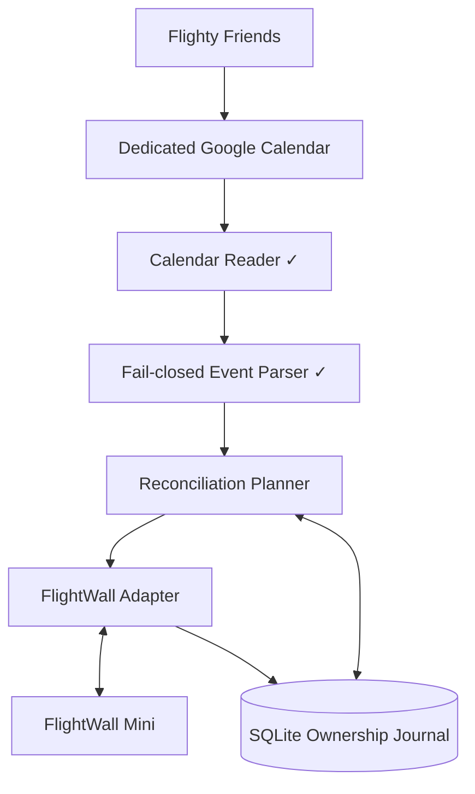
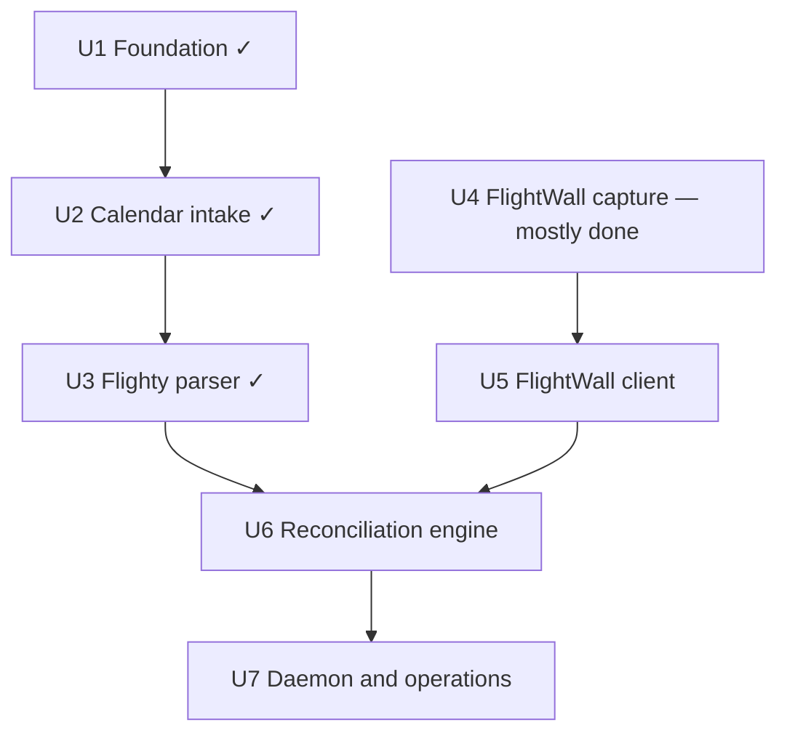

# feat: Sync Flighty Friends to FlightWall Mini

## Status

| Unit | State | Evidence |
| --- | --- | --- |
| U1 Foundation and state | done | `b9ad5c7`; config moved to pydantic in `3e3122c` |
| U2 Google Calendar intake | done, verified live | `97f9a63`, `be1a3b0`, `b792263` |
| U3 Flighty event parser | done, verified live | `b87df2c` |
| U4 FlightWall contract capture | **mostly done**; 4 cheap sequences open | contract captured 2026-09-22 from the owner's Mac; fixtures committed; gate rows 6 and 7 open |
| U5 FlightWall client | **unblocked**, not started | reduced design: whole-document GET/POST, no mode, no per-entry ID |
| U6 Reconciliation engine | not started | gated by U5; auto-remove waits on gate row 6, sixth-flight handling on row 7 |
| U7 Daemon and operations | not started | gated by U6 |

`mise run check` is green: 103 tests, 94% coverage, all hooks passing.

**What the capture changed:** area tracking and tracked flights coexist, so there is no display
mode to lease and **R9 is withdrawn**. The wall exposes one configuration document; add and
remove are both a whole-document `POST`, last-writer-wins, keyed by `flight_number`. Ownership
is therefore entirely daemon-side. Details: `docs/flightwall-api-discovery.md` §4, §7, §8.

---

## Overview

Build a small Python service that reads Flighty Friends events from a dedicated Google Calendar, normalizes those events into flights, and safely reconciles them with the owner's FlightWall Mini. The service preserves manually tracked flights. Tracked flights display alongside the owner's area tracking; the earlier plan to switch display modes was withdrawn once the capture showed no such mode exists.

The calendar half is complete: a calendar-isolated service account reads the dedicated calendar, the parser turns real Flighty exports into stable flight records, and both fixture writers sanitize real data before it is committed. The FlightWall contract has been captured from the owner's own Mac and is simpler than assumed: one configuration document, no display mode, no per-entry identifiers. The client, reconciliation, and daemon units are unblocked.

---

## Problem Frame

Flighty already knows the owner's Friends' upcoming flights, but FlightWall requires those flights to be added separately. Manual copying is repetitive and easy to miss. Flighty's supported Calendar Export bridges the data to Google Calendar; the Linux service must then automate FlightWall without scraping Flighty, exposing credentials, deleting manual wall entries, or fighting the owner's display controls (see origin: `docs/brainstorms/2026-09-21-flighty-friends-flightwall-sync-requirements.md`).

---

## Requirements Trace

- R1. Read Flighty Friends events from one dedicated Google Calendar using read-only authorization. — **met (U2)**
- R2. Accept only events that identify a flight unambiguously with flight number and departure context. — **met (U3)**
- R3. Reconcile additions, updates, cancellations, and deletions without duplicates. — parser side met (U3); wall side pending (U6)
- R4. Include every Friend exported to the dedicated calendar in v1. — **met (U2, U3)**
- R5. Make unchanged sync runs idempotent. — pending (U6)
- R6. Make polling and lookahead configurable; default to a two-minute poll and seven-day lookahead. — **met (U1)**; poll loop pending (U7)
- R7. Persist explicit ownership of daemon-created FlightWall entries. — pending (U5, U6); the wall offers no ownership signal, so this is entirely the daemon's journal
- R8. Never modify or remove manually created FlightWall entries. — pending (U6); gate row 5 passes on the journal design
- R9. ~~When FlightWall exposes authoritative activity and mode provenance, temporarily use Flight Tracking Mode…~~ — **withdrawn 2026-09-22**: the wall has no display mode; tracked flights show regardless of area settings
- R10. Keep all overlapping active Friend flights available. — parser side met (U3); wall side pending (U6); five-entry cap confirmed
- R11. Run unattended under systemd with restart behavior and actionable logs. — pending (U7)
- R12. Keep Google and FlightWall credentials out of source control and logs. — Google side met (U1, U2); FlightWall side pending (U5)
- R13. Provide an authoritative dry run when both sources are available and a clearly provisional, non-mutating local-intent report when FlightWall is unavailable. — pending (U6, U7)
- R14. Treat incomplete or failed upstream reads as non-authoritative and perform zero FlightWall mutations from them. — calendar side met (U2, U3); wall side pending (U5, U6)

**Origin actors:** A1 (owner), A2 (Flighty Friend), A3 (Flighty), A4 (Linux sync service), A5 (FlightWall Mini)

**Origin flows:** F1 (sync an upcoming Friend flight), F2 (display an active Friend flight — now satisfied by presence in `tracked_flights`; no mode switch), F3 (return to normal area tracking — reduces to removing the daemon's own stale entries)

**Origin acceptance examples:** AE1 (calendar updates remain idempotent), AE2 (manual entries survive deletion), AE3 (overlapping flights and mode restoration), AE4 (dry-run and failure safety)

---

## Scope Boundaries

- Support one dedicated Google Calendar and all Friends exported into it.
- Do not scrape Flighty or use an undocumented Flighty API.
- Do not modify FlightWall firmware or replace its aircraft-data providers.
- Use only the owner's FlightWall account, device, and authenticated app requests.
- Do not build a dashboard, multi-user service, notification system, or per-Friend rules in v1.
- Do not promise compatibility with an undocumented FlightWall backend beyond the captured and tested contract.
- Do not automate CAPTCHA, device enrollment, or account recovery.

### Deferred to Follow-Up Work

- Per-Friend include/exclude rules and custom display windows.
- Support for multiple Google calendars or multiple FlightWall devices.
- A supported vendor integration if TheFlightWall publishes an API after v1.
- Replacing the `isinstance` chain in `calendar.py` with a `GoogleEvent(BaseModel, extra="allow")` once the parser contract has been stable for a while.

---

## Context & Research

### Established Code and Patterns

Later units must fit the conventions the first three units set:

- `src/` layout with relative imports inside `src/flighty_wall/`; frozen dataclasses in `models.py` for internal values; `typing.Protocol` at every external boundary (`CalendarGateway`, `_DiscoveryModule`) so tests inject fakes without patching.
- `config.py` is nested pydantic (`AppConfig.google/.service/.storage/.calendar_limits`) with `strict=True`, `extra="forbid"`, range bounds in `Field`, and filesystem probes (`require_private_file`, state-parent check) run after validation, outside the model. New settings go in a new nested table, not a flat key.
- `cli.py` is a click group. Dependencies travel through `ctx.obj` as the frozen `Deps` dataclass; tests use `CliRunner().invoke(cli, [...], obj=Deps(...))`. Exit code 2 means config/usage error or a non-authoritative result, and nothing is written on exit 2.
- `CalendarReader.read_snapshot()` returns a `Snapshot` whose `authority` is explicit. A bound breach, request failure, or partial page yields a typed reason string, never a partial event list. Reconciliation must consume `authority`, never infer it from emptiness.
- `parser.parse_cycle()` is pure. The flight key is `DESIGNATOR:ORIGIN:UTC-departure-date`, carrying the set of contributing Google event IDs. Any Flighty-like event without an authoritative interpretation makes the whole cycle non-authoritative.
- All redaction rules live in `redaction.py` and are shared by both fixture writers. Fixtures are written atomically at mode `0600`. JSON goes through `orjson` only; the stdlib `json` module is banned by ruff.
- `mise run check` is the gate: prek hooks (ruff `ALL`, mypy strict, pyright strict, tombi, yamlfmt, actionlint, zizmor, yamllint) plus `pytest --cov` (floor 80%) plus `deptry`.

### Institutional Learnings

- A sanitizer cannot be trusted until it has processed real data. The U2 live capture found two leaks (`flighty://` deeplinks, `iCalUID`) that mocked tests had missed. The U4 sanitizer has only seen synthetic HARs; its gate row must be re-checked by hand once real fixtures exist.
- Flighty's export carries invisible characters in `summary`: `U+00A0` between carrier and number, `U+200B` around the route arrow. Any new text handling on calendar data must normalize both first.
- Google API success proves Google readability, not Flighty freshness. Observation time and each event's `updated` are separate fields and must stay separate in diagnostics.

### External References

- Flighty officially supports exporting Friends' flights with the Friend's name and standard flight information: https://flighty.com/help/calendar-export
- Flighty's calendar troubleshooting recommends isolated calendars to prevent duplicate import/export loops: https://flighty.com/help/troubleshoot-calendar-sync
- FlightWall supports tracked flights by flight number, callsign, or tail number, separates Flight Tracking Mode from Area Tracking Mode, and displays up to five flights at a time: https://theflightwall.com/products/flightwall-mini-flight-tracking-led-display
- The public FlightWall OSS project is a DIY ESP32 build with no companion app or local API; it does not document the commercial app backend: https://github.com/AxisNimble/TheFlightWall_OSS
- Google documents service-account credentials for server-to-server access: https://developers.google.com/identity/protocols/oauth2/service-account
- Google documents explicit calendar sharing and access roles: https://developers.google.com/workspace/calendar/api/concepts/sharing
- Google documents `events.list` pagination, cancellation behavior, and time-window filters: https://developers.google.com/workspace/calendar/api/v3/reference/events/list
- Mitmproxy documents installing its local certificate authority for traffic inspection on devices the operator controls: https://docs.mitmproxy.org/stable/concepts/certificates/
- Android documents why apps may reject user-installed certificate authorities and how network security policy affects inspection: https://developer.android.com/privacy-and-security/security-config

---

## Key Technical Decisions

- **Python 3.11+, `pyproject.toml`, `uv.lock`; libraries at the edges, stdlib in the middle:** `click` owns argument parsing, `pydantic` owns parsing TOML into typed config, `orjson` owns JSON. Domain values stay as frozen dataclasses; `tomllib`, `zoneinfo`, `sqlite3`, and `logging` come from the standard library.
- **One long-running process supervised by systemd:** The process polls on a monotonic schedule; systemd owns boot startup, restart policy, filesystem permissions, and log collection.
- **Calendar-isolated Google service account:** Only the dedicated Flighty calendar is shared, read-only, with a service account requesting `calendar.readonly`. A personal refresh token would reach every calendar in the owner's account; Google scopes themselves are not calendar-bound.
- **Bounded full-window reads instead of Calendar sync tokens:** A two-minute poll over the next seven days is small for a dedicated calendar. Page, event, field-length, and total-byte caps prevent a calendar writer from exhausting the daemon; exceeding any cap makes the cycle non-authoritative.
- **Cycle-wide fail-closed parsing:** Any unrecognized or ambiguous event that could be a Flighty export makes the cycle non-authoritative for all wall mutations. The sanitized real export is the parser's contract fixture.
- **FlightWall capability gate before contract-specific code:** The captured contract must prove complete list/mode reads, stable identifiers, simultaneous flights, authoritative activity, safe conditional deletion and mode provenance, recoverable uncertain mutations, capacity behavior, and reschedule semantics. A missing capability stops implementation and returns for a scope decision; it does not license a weaker guarantee.
- **Capacity of five is a normal condition:** Confirmed: the app stops offering Add at five entries. Server behaviour when POSTing six is still untested (gate row 7). Reconciliation must plan for being at capacity without treating it as an error and without ever evicting an entry the daemon does not own.
- **Isolated FlightWall adapter:** Endpoint, authentication, headers, payloads, identifiers, and error semantics come only from the owner's authorized capture. Production requires normal TLS verification and an allowlisted hostname; capture trust never reaches the daemon.
- **Whole-document writes demand a read-modify-write discipline:** The wall has one configuration document and `POST` replaces all of it. The daemon must GET immediately before every POST, touch only `request_config.tracked_flights`, send every other byte back unchanged, and refuse to write if the document's key set or `display_config.model` differs from the captured fingerprint. This is the only defence against clobbering the owner's area, brightness, and sleep settings.
- **Ownership journal is the sole ownership record:** The wall carries no actor, source, or per-entry ID. The daemon may remove a `flight_number` only if its own journal says the daemon added it; any `flight_number` present on first observation is manual forever. Ambiguous entries are never adopted or deleted.
- **Plan-then-apply reconciliation:** Authoritative calendar and wall snapshots produce the executable plan. An offline dry run emits only a clearly labeled provisional calendar-and-journal intent report.
- **No mode lease:** Withdrawn 2026-09-22. Tracked flights display regardless of area settings, so there is nothing to switch or restore.
- **Privacy-safe logs and state:** Log event IDs, normalized flight identifiers, action types, and error classes. Never log credentials, reservation codes, seat numbers, full descriptions, raw captures, or Friend names by default.

---

## Open Questions

### Resolved

- **How should Flighty data reach Linux?** Through Flighty's supported export to a dedicated Google Calendar. Verified live 2026-09-22.
- **How should Google Calendar be read?** A service account with read-only sharing on only the Flighty calendar. Verified live 2026-09-22; no personal token is stored.
- **What is the exact Flighty event shape?** Recorded in `tests/fixtures/google_calendar/README.md` from a real capture: `"<Friend>: ✈ DUB→BCN • VY 8721"` in `summary` with `U+00A0`/`U+200B`, structured `description`, `start`/`end` with explicit time zones, un-padded flight numbers.
- **What are the polling defaults?** 120 seconds and seven days, bounded to 30–86 400 seconds and 1–30 days in `config.py`.
- **How should ambiguous parsing affect safety?** The whole cycle becomes non-authoritative and permits no wall mutation. Implemented in U3.
- **Is there a documented FlightWall interface that avoids the capture?** No. The vendor offers no API, webhooks, or integrations; the OSS project is a different device with no app.
- **Are area tracking and flight tracking mutually exclusive?** No — captured 2026-09-22. One document holds both; the app says tracked flights show regardless of area settings. R9 withdrawn, mode lease dropped.
- **What identifier format does the wall accept?** The `flight_number` string as typed: `EI61`, `BA5`. No padding, no space. U3's designator maps directly.
- **Does the wall distinguish manual entries from app-added ones?** No. Ownership rests entirely on the daemon's journal.
- **What are the delete and mode-write preconditions?** None exist. Writes are whole-document, last-writer-wins; `version` did not change across two successful writes. Safe removal is read-modify-write with the journal as the filter.

### Open — cheap to close, see discovery §8

- **Server behaviour at six entries** (gate row 7). Blocks adding when the wall is full.
- **Recovery after an interrupted POST** (gate row 6). Blocks automatic removal.
- **Is `version` decorative?** POST with a wrong value and see.
- **Post-landing behaviour.** "Will auto-remove" and tracking history are visible in the app but not in `/configuration`; the daemon may find its entries gone without having removed them.
- **Key lifetime and extraction.** The daemon needs the per-user `x-api-key` and `x-user-id` from the owner's signed-in app. Whether they survive sign-out, and where they live in the app container, is unknown.
- **Contract drift and rate limits:** `display_config.model`, the top-level key set, and the `tracked_flights[]` key set are the fingerprint. Unknown fingerprints force read-only mode until recapture.

---

## Output Structure

```text
.
├── pyproject.toml, uv.lock, mise.toml, mise.lock, .python-version
├── .pre-commit-config.yaml, .yamlfmt.yaml, .yamllint.yaml, tombi.toml
├── .github/workflows/ci.yml
├── LICENSE, NOTICE, README.md, config.example.toml
├── docs/
│   ├── brainstorms/2026-09-21-flighty-friends-flightwall-sync-requirements.md
│   ├── plans/2026-09-21-001-feat-flighty-flightwall-sync-plan.md
│   ├── plans/2026-09-22-001-chore-click-pydantic-migration-plan.md   (done)
│   └── flightwall-api-discovery.md            (U4: findings tables empty until capture)
├── src/flighty_wall/
│   ├── __init__.py, __main__.py
│   ├── auth.py          service-account gateway
│   ├── calendar.py      bounded authoritative reads
│   ├── capture.py       HAR → sanitized FlightWall fixtures
│   ├── cli.py           click group: inspect-calendar, sanitize-capture
│   ├── config.py        pydantic AppConfig
│   ├── models.py        frozen domain values
│   ├── parser.py        Flighty event → Flight, fail-closed
│   ├── redaction.py     shared redaction rules
│   ├── state.py         SQLite bootstrap, permissions, atomic metadata
│   ├── flightwall.py    (U5)
│   ├── reconcile.py     (U6)
│   └── service.py       (U7)
├── systemd/flighty-wall.service               (U7)
└── tests/
    ├── fixtures/google_calendar/{README.md, friend-flight.json, cancelled-flight.json}
    ├── fixtures/flightwall/README.md          (fixtures arrive with U4)
    ├── test_auth.py, test_calendar.py, test_capture.py, test_cli.py,
    ├── test_config.py, test_parser.py, test_redaction.py, test_state.py
    ├── test_flightwall.py                     (U5)
    ├── test_reconcile.py                      (U6)
    └── test_service.py                        (U7)
```

Setup documentation lives in `README.md`; the separately planned `docs/setup.md` was folded into it.

---

## High-Level Technical Design

> *Directional guidance for review, not implementation specification.*



Each poll produces one of three outcomes:

1. **Authoritative snapshot:** Every bounded calendar page plus one `200` `GET /configuration` whose key set and `display_config.model` match the captured fingerprint. The service may plan mutations.
2. **Non-authoritative snapshot:** Any source read, parser authority check, bound, authentication step, or fingerprint check fails. The service logs the failure and performs zero FlightWall mutations.
3. **Provisional offline dry run:** Calendar and journal data describe local intent, but every action that depends on current FlightWall state is labeled unknown and cannot be applied.

Write path — the only mutation the daemon ever makes:

```mermaid
sequenceDiagram
    participant D as Daemon
    participant W as api.theflightwall.com
    D->>W: GET /configuration
    W-->>D: document (version, display_config, request_config)
    D->>D: fingerprint check; edit only request_config.tracked_flights
    D->>D: journal pending intent
    D->>W: POST /configuration (whole document + userId)
    W-->>D: document + meta
    D->>W: GET /configuration
    D->>D: resolve intent against fresh read
```

The GET→POST window is a last-writer-wins race with the owner's app. It is unavoidable under this contract; keeping it short and re-reading after every write is the mitigation.

---

## Implementation Units



- [x] U1. **Package, configuration, domain models, durable state** — `b9ad5c7`, config rewritten with pydantic in `3e3122c`.

  Landed: `pyproject.toml`, `config.example.toml`, `config.py` (nested `AppConfig`), `models.py`, `state.py` (schema-versioned SQLite with `0700`/`0600` checks including WAL/SHM, atomic metadata), `tests/test_config.py`, `tests/test_state.py`. FlightWall-specific tables were deliberately not created; they arrive in U5/U6 after the gate.

- [x] U2. **Google authorization and authoritative calendar snapshots** — `97f9a63`, `be1a3b0`, `b792263`. Verified live 2026-09-22.

  Landed: `auth.py`, `calendar.py`, the `inspect-calendar` command with `--lookahead-days`/`--lookback-days` (up to 365) for captures beyond the daemon window, `tests/fixtures/google_calendar/friend-flight.json` from two real Friends' flights. Carry forward: observation time and event `updated` are separate fields; a bound breach or failed page is a typed non-authoritative reason, never an empty calendar.

- [x] U3. **Normalize and validate Flighty calendar events** — `b87df2c`. Verified live 2026-09-22 against real, unredacted summaries: two events, two flights, zero unrecognized.

  Landed: `parser.py`, `tests/fixtures/google_calendar/cancelled-flight.json`, `tests/test_parser.py`. Decisions U6 depends on:
  - Flight key `DESIGNATOR:ORIGIN:UTC-departure-date`: a same-day delay updates one entry; a move to another day yields a new key. Contributing event IDs attach to the key; the freshest `updated` wins on a departure-instant disagreement.
  - A codeshare (one leg claimed by two designators at the same instant) makes the cycle non-authoritative; the export carries no codeshare data to disambiguate.
  - The ✈ glyph is a required Flighty marker: if Flighty drops its footer, a flight fails the cycle loudly instead of vanishing from the wall.
  - Failure reasons carry the Google event ID and never event text.

---

- [ ] U4. **Capture and document the authorized FlightWall contract** — **contract captured 2026-09-22; four cheap sequences open**

**Goal:** Observe the exact commercial-app requests needed to list, add, and remove tracked flights, and prove the capability gate, before any code targets the backend.

**Requirements:** R7, R8, R10, R12, R14; F2, F3 (R9 withdrawn)

**Landed (`d92d56c`, `388078c`, `a4ffe0c`, `4c43347`, and the capture commit):**
- Capture ran from `TheFlightWall.app` on the owner's Mac through `mise run capture:start` / `capture:stop`, driven via System Events. No pinning; zero TLS errors.
- Fixtures: `tests/fixtures/flightwall/{get-configuration,post-configuration-add,post-configuration-remove,get-feature-flags}.json`, each with a §6 provenance row, scanned against the raw HAR for both API keys, the user id, and home coordinates: zero hits.
- Sanitizer gap found and fixed: the POST body's opaque `userId` survived the first pass; `userid`/`user_id`/`device_id`/`account_id` added to `SENSITIVE_BODY_KEYS` with a regression test.
- Findings written to `docs/flightwall-api-discovery.md` §1, §3, §4, §6, §7.

**What the capture proved** (details and fixtures in the discovery document):
- One document, `GET`/`POST /configuration`, auth by `x-api-key` + `x-user-id` headers. Tracked flights are `request_config.tracked_flights[] = {flight_number, created_at, show_distance_travelled, show_metrics}`, at most five, unpaginated.
- Add and remove are both a whole-document `POST`. `version` did not change across two writes; no ETag. **Last-writer-wins.**
- No display mode. No per-entry ID, actor, or source. `flight_number` is stored as typed.
- Fingerprint: `display_config.model == "mini-v1"`, the top-level key set, the `tracked_flights[]` key set.

**Gate verdict:** rows 1–5, 8, 10 pass (several as "reduced": the contract is simpler than the gate assumed). Row 9 not applicable. **Rows 6 and 7 open** — U5 may start; U6 must not enable automatic removal until row 6 closes, nor add a sixth flight until row 7 does.

**Remaining — each a few minutes with the proxy up (discovery §8):**
1. Sequence 9: POST a six-entry document; record status and body. Closes row 7.
2. Sequence 12: interrupt a POST before the response, GET, compare. Closes row 6.
3. POST with a wrong `version` to confirm it is decorative.
4. Sequence 13: watch `EI61` land; diff `/configuration` before and after.
5. Sequence 14: re-run `GET /configuration` with the captured key pair after sign-out and after 24 h.
6. Locate the per-user `x-api-key` and `x-user-id` in the app container and document the extraction step for the daemon's credential file.

---

- [ ] U5. **Implement the defensive FlightWall client**

**Goal:** Encapsulate the captured contract behind a validated client that exposes read-configuration and replace-tracked-flights, and nothing else.

**Requirements:** R5, R7, R8, R10, R12, R14; F2, F3

**Dependencies:** U4 gate rows 1–5, 8, 10 (passed). Rows 6–7 gate U6 behaviour, not this unit.

**Files:**
- Create: `src/flighty_wall/flightwall.py`
- Modify: `src/flighty_wall/config.py` — add a `[flightwall]` table: `host` (allowlisted, default `api.theflightwall.com`), `credentials_path` (a `0600` file holding the per-user `x-api-key` and `x-user-id`), `timeout_seconds`; probed with `require_private_file` like the Google key
- Modify: `config.example.toml`
- Modify: `src/flighty_wall/state.py` — `owned_flights(flight_number, first_added_at, source_keys)` and `pending_writes(intent, document_hash, started_at)`; nothing for mode
- Modify: `src/flighty_wall/cli.py` — add `probe-wall`, a read-only authoritative snapshot command printing the tracked list and fingerprint
- Modify: `pyproject.toml` — add `httpx`
- Test: `tests/test_flightwall.py`, `tests/test_state.py`, `tests/test_cli.py`

**Approach:**
- `WallSnapshot` is authoritative only when `GET /configuration` returns `200`, parses, and matches the fingerprint (`display_config.model`, top-level key set, `tracked_flights[]` key set). Same shape as `calendar.Snapshot`: authority is explicit, never inferred.
- Exactly two operations: `read() -> WallSnapshot` and `replace_tracked_flights(snapshot, flights) -> WallSnapshot`. The second takes the snapshot it was planned against, mutates only `request_config.tracked_flights` in a copy of that snapshot's raw document, adds `userId`, POSTs, and returns the re-read. Every other byte of the document is passed through untouched — the client never constructs a document from its own model.
- New entries are `{flight_number, created_at: now (RFC3339 Z), show_distance_travelled: true, show_metrics: true}` — the shape the app writes. The designator from U3 maps 1:1 onto `flight_number`.
- Refuse to POST more than five entries until gate row 7 says what the server does with six.
- HTTPS with normal certificate validation, allowlisted host, no redirects followed. Capture CA and `verify=False` are rejected at config load.
- Bounded timeouts. GET may retry; POST never retries blindly — an unknown outcome is returned as unknown for U6 to resolve by re-reading.
- Distinct errors for 401/403 (bad key pair), 429, 5xx, transport, schema/fingerprint drift. Drift forces read-only mode.

**Test scenarios:**
- Happy path: `get-configuration.json` → authoritative snapshot with `['EI61']`, fingerprint `mini-v1`.
- Happy path: replace against that snapshot with `['EI61','BA5']` produces a POST body byte-identical to `post-configuration-add.json`'s request apart from `created_at` and `userId`; `display_config` and `radius_request` are unchanged.
- Happy path: replace with `['EI61']` matches `post-configuration-remove.json`.
- Edge case: replace with six entries raises before any request is made.
- Error path: `display_config.model != "mini-v1"`, a missing top-level key, or an extra `tracked_flights[]` key → non-authoritative, and `replace` refuses.
- Error path: timeout after POST → unknown outcome, no retry, no second POST.
- Error path: 401/403 → credential error naming the header, never its value; 429/5xx → retryable with delay metadata.
- Security: a redirect to another host is not followed; `verify=False` or a CA path in config fails at load; logs never contain `x-api-key`, `x-user-id`, `userId`, or coordinates.

**Verification:**
- All four committed fixtures pass without network access, plus synthetic drift and six-entry fixtures.
- `probe-wall` produces one authoritative snapshot against the real wall without changing it.
- A mutating probe exists only behind an explicit flag and prints the exact before/after `tracked_flights`.

---

- [ ] U6. **Build ownership-safe reconciliation**

**Goal:** Compute and apply idempotent calendar-to-wall changes while preserving manual entries.

**Requirements:** R3, R4, R5, R6, R7, R8, R10, R13, R14; F1, F2, F3; AE1, AE2, AE4 (AE3 reduced: overlap without mode)

**Dependencies:** U5. Automatic removal additionally waits on U4 gate row 6; adding when the wall holds five waits on row 7.

**Files:**
- Create: `src/flighty_wall/reconcile.py`
- Test: `tests/test_reconcile.py`

**Approach:**
- One authoritative calendar snapshot plus the ownership journal plus one authoritative `WallSnapshot` yield a deterministic plan: the desired `tracked_flights` list. Any non-authoritative input yields no plan.
- Ownership is the journal, full stop. On the first authoritative wall read, every `flight_number` present is recorded as manual. Thereafter a `flight_number` is removable only if the journal says the daemon added it and no calendar source still wants it. A manual entry is never removed, even if a Friend later flies the same number — the daemon adopts nothing.
- Desired list = manual entries (unchanged) + daemon-owned entries still wanted + new wanted flights, in that order, capped at five. If the cap is hit, add nothing new, remove only conclusively stale owned entries, and report the unplaceable flights. Never evict a manual entry.
- Consume U3's key: a same-day time change is a no-op on the wall; a day change is remove-old + add-new in one POST (a single document write, so no intermediate state).
- Journal pending intent (document hash, desired list) before the POST; resolve it against the re-read the client returns. On restart with an unresolved intent, re-read and re-plan — POST is idempotent on content, so a lost response is recovered by comparing, not retrying.
- If the wall's list already equals the desired list, do not POST. Ten identical cycles must make zero writes.
- Authoritative dry-run and normal mode share the planner. With the wall unavailable, dry-run emits a provisional local-intent report with every remote-dependent action marked unknown.

**Test scenarios:**
- F1/AE1: repeated identical snapshots produce one POST then none; a gate-only calendar update produces no POST.
- F3/AE2: a wall with manual `EI61` and daemon-added `BA5`; deleting BA5's calendar event yields a POST with `['EI61']`. Deleting a hypothetical event for `EI61` yields no POST.
- AE3 (reduced): two Friends' flights overlapping yield both in `tracked_flights`; both removed only when both sources are gone.
- AE4: authoritative dry-run prints the desired list without POSTing; wall-outage dry-run prints provisional intent and changes no state.
- Error path: non-authoritative calendar, ambiguous event, fingerprint drift, or non-authoritative wall → no POST, journal untouched.
- Recovery: unresolved pending intent at startup → re-read; if the wall already matches, resolve without POST; if not, re-plan from scratch.
- Edge case: a Friend flies a number that is a manual entry → suppress the add, never adopt, never remove; visible in dry-run.
- Edge case: wall at five with one stale owned entry → one POST that swaps it; wall at five with no stale owned entry → no POST, unplaceable flights reported.
- Edge case: day change → one POST containing new and not old.
- Edge case: first-ever wall read records all present entries as manual.

**Verification:**
- The matrix proves idempotency, ownership isolation, capacity handling, dry-run parity, and restart recovery.
- No path can produce a desired list that omits a `flight_number` the journal marks manual.

---

- [ ] U7. **Daemon lifecycle, remaining commands, systemd, end-to-end verification**

**Goal:** Make the service installable, observable, recoverable, and straightforward to operate on the Linux host.

**Requirements:** R6, R11, R12, R13, R14; all success criteria; AE4

**Dependencies:** U6

**Files:**
- Create: `src/flighty_wall/service.py`
- Create: `systemd/flighty-wall.service`
- Modify: `src/flighty_wall/cli.py` — add one-cycle dry run, one-cycle apply, and continuous `run`; `inspect-calendar`, `sanitize-capture`, and `probe-wall` already exist
- Modify: `README.md` — add install, first dry run, controlled first apply, service enablement, credential rotation, backup/retention, troubleshooting
- Test: `tests/test_service.py`, `tests/test_cli.py`

**Approach:**
- One synchronization engine behind CLI and daemon paths so dry-run and production cannot drift.
- Signal-aware shutdown and a monotonic loop; never start a second cycle while one runs.
- One host-wide lock shared by continuous mode, one-cycle apply, and pending-operation recovery. A competing mutating process exits busy with an actionable message; read-only inspection remains available.
- Introduce `logging` here, not before: `getLogger(__name__)` per module, configured once in the daemon entry point to stderr for the journal, level from config. `inspect-calendar` and `sanitize-capture` keep `click.echo` — they are user-facing diagnostics, not the service. Privacy rule applies: IDs, designators, action types, error classes; never credentials, reservation codes, seats, descriptions, or Friend names.
- Dedicated unprivileged user, `0700` state/config directories, `0600` credential/state files, restrictive umask, restart-on-failure, explicit writable paths, journal logging, `NoNewPrivileges`, empty capabilities, `ProtectSystem=strict`, `ProtectHome`, `PrivateTmp`, bounded tasks/memory where supported.
- Startup status line and per-cycle summary: counts and durations only.

**Test scenarios:**
- One-cycle dry run exits 0, prints stable action counts, never invokes a mutating client method.
- Continuous mode schedules one cycle at a time and honors the interval with an injected clock/sleeper.
- Fixture-backed calendar plus fixture-backed wall produce expected plans through the real click boundary.
- Calendar auth failure, wall auth failure, and SQLite failure produce distinct non-zero exits and journal-safe diagnostics.
- SIGTERM during sleep exits cleanly; during a cycle completes or checkpoints first.
- A cycle longer than the interval does not overlap the next.
- While the daemon holds the lock, apply and recovery fail busy without mutation; inspection still works.
- Environment, status output, and exceptions reveal no credential values or sensitive calendar fields.
- `systemd-analyze security` meets the documented baseline or records a justified exception.

**Verification:**
- A new Linux install completes authorization, dry-run, controlled apply, reboot, and automatic restart from `README.md` alone.
- systemd reports healthy status and one concise summary per cycle.
- End-to-end fixture tests cover AE1–AE4 without contacting Google or FlightWall.

---

## System-Wide Impact

- **Interaction graph:** Flighty updates Google Calendar; the service reads and parses events; reconciliation joins calendar state, SQLite ownership, wall state, and time; the FlightWall adapter performs mutations; systemd owns process lifecycle.
- **Error propagation:** Any incomplete calendar or wall read, parser ambiguity, bound breach, failed provenance check, or unknown contract fingerprint becomes non-authoritative. The service logs and retries later but performs zero wall mutation. Mutation uncertainty is journaled before further changes.
- **State lifecycle risks:** Crashes between remote POST and local commit, duplicate source events for one flight, the GET→POST last-writer-wins window against the owner's app, and the five-flight cap. Journal-first pending intents, content-idempotent POSTs resolved by re-reading, and a desired-list planner that never drops manual entries address these conservatively.
- **API surface parity:** Inspection, probe, dry-run, one-shot apply, and daemon mode share configuration, parser, planner, state, and client boundaries.
- **Integration coverage:** Fixture-backed end-to-end tests prove cross-layer flows; one controlled live validation per external contract keeps routine tests offline.
- **Unchanged invariants:** Flighty remains the human-facing source of Friends and flights. FlightWall firmware, data providers, device enrollment, manually tracked entries, and unrelated settings remain untouched.

---

## Risks & Dependencies

| Risk | Mitigation |
| --- | --- |
| FlightWall changes its undocumented backend | Fingerprint `display_config.model`, top-level keys, and `tracked_flights[]` keys on every read; drift forces read-only mode until recapture. |
| FlightWall lacks a requirement-critical capability | Gate rows 6–7 still open. U6 keeps automatic removal and sixth-flight adds disabled until they close; nothing else is blocked. |
| Owner edits the app during the daemon's GET→POST window | Last-writer-wins is inherent to the contract. Keep the window to one read and one write, re-read after every POST, and treat any unexpected difference as a reason to re-plan rather than retry. |
| Daemon clobbers the owner's area, brightness, or sleep settings | The client passes every non-`tracked_flights` byte of the fetched document back unchanged and never builds a document from its own model. Tested byte-for-byte against the captured POST bodies. |
| HTTPS interception leaks credentials or weakens production TLS | Ephemeral restricted capture environment, raw flows deleted, credentials rotated, CA removed; capture trust and disabled verification rejected at config load. |
| Flighty changes calendar event formatting | Characterization fixtures, cycle-wide fail-closed parsing, redacted diagnostics, `mise run fixture:calendar` to refresh. |
| Calendar or wall outage appears as an empty source | Authority is explicit on every snapshot; all non-authoritative inputs cause zero wall mutation. |
| Calendar writer submits hostile or excessive events | Private calendar ACL, calendar-isolated service account, candidate-shape validation, page/event/field/byte caps. |
| Flighty-to-Google export is delayed or stale | Observation time and event `updated` reported separately; API success never claims Flighty freshness. |
| Crash after remote POST but before local commit | Journal intent first; on restart re-read and compare — POST is idempotent on content, so recovery is a diff, not a retry. |
| Manual app changes race the daemon | See the GET→POST row. There is no conditional write to lean on; the mitigation is a short window and a re-read. |
| Wall is at its five-flight cap | Plan around capacity; remove only conclusively stale owned entries; never evict a manual entry; report unplaceable flights. |
| Credentials or travel state leak from disk or backup | `0700` directories, `0600` files/WAL/SHM, atomic writes, redacted logs, encrypted backups, retention, secure deletion guidance. |
| Polling triggers rate limits | Seven-day bounded calendar query, mutate only on change, honor server retry guidance, configurable interval. |

---

## Success Metrics

- A new Friend flight exported by Flighty appears in the next successful calendar snapshot and is added to FlightWall once.
- Ten unchanged sync cycles produce zero FlightWall mutations after initial convergence.
- Calendar deletion removes only the exact daemon-owned entry; manual entries remain unchanged in all automated tests.
- Overlapping Friends' flights are both present in `tracked_flights` until each becomes inactive; there is no display mode to restore.
- Simulated Google, FlightWall, and process failures never trigger broad deletion or loss of ownership state.
- A clean Linux host reaches a successful dry run by following `README.md` without reading source code.

---

## Documentation / Operational Notes

- `README.md` carries all setup: Google calendar and service account (done), Flighty export (done), fixture capture (done), FlightWall capture (done from the Mac; four short sequences open), and — from U7 — daemon installation, first dry run, controlled first apply, credential rotation, backup, troubleshooting.
- `docs/flightwall-api-discovery.md` records app version and capture date per fixture so future breakage can be compared with the known contract; §8 lists what is still to capture.
- Back up SQLite state only to encrypted, access-controlled storage; include WAL/SHM consistency, retention, restoration, and secure deletion procedures.
- First deployment sequence: close gate rows 6–7 → extract the key pair into a `0600` credentials file → `capture:stop --purge` → fixture tests → `probe-wall` read-only → review an authoritative dry run → one controlled apply → enable the daemon.

---

## Sources & References

- **Origin document:** [`docs/brainstorms/2026-09-21-flighty-friends-flightwall-sync-requirements.md`](../brainstorms/2026-09-21-flighty-friends-flightwall-sync-requirements.md)
- **Tooling migration (done):** [`docs/plans/2026-09-22-001-chore-click-pydantic-migration-plan.md`](2026-09-22-001-chore-click-pydantic-migration-plan.md)
- **Capture protocol and capability gate:** [`docs/flightwall-api-discovery.md`](../flightwall-api-discovery.md)
- Flighty Calendar Export: https://flighty.com/help/calendar-export
- Flighty Friends: https://flighty.com/help/flighty-friends
- Flighty calendar troubleshooting: https://flighty.com/help/troubleshoot-calendar-sync
- FlightWall Mini product and FAQ: https://theflightwall.com/products/flightwall-mini-flight-tracking-led-display
- FlightWall OSS project: https://github.com/AxisNimble/TheFlightWall_OSS
- Google service accounts: https://developers.google.com/identity/protocols/oauth2/service-account
- Google Calendar sharing: https://developers.google.com/workspace/calendar/api/concepts/sharing
- Google Calendar `events.list`: https://developers.google.com/workspace/calendar/api/v3/reference/events/list
- Mitmproxy certificates: https://docs.mitmproxy.org/stable/concepts/certificates/
- Android network security configuration: https://developer.android.com/privacy-and-security/security-config
