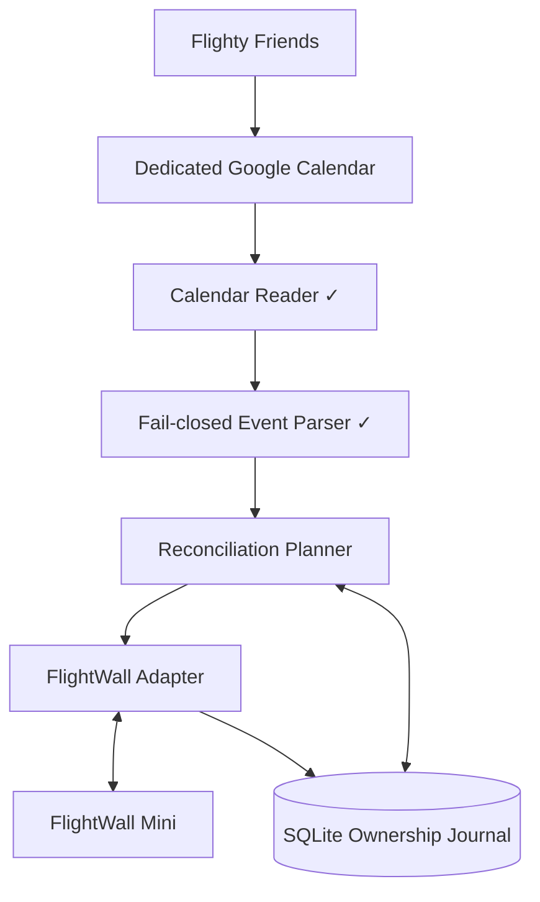
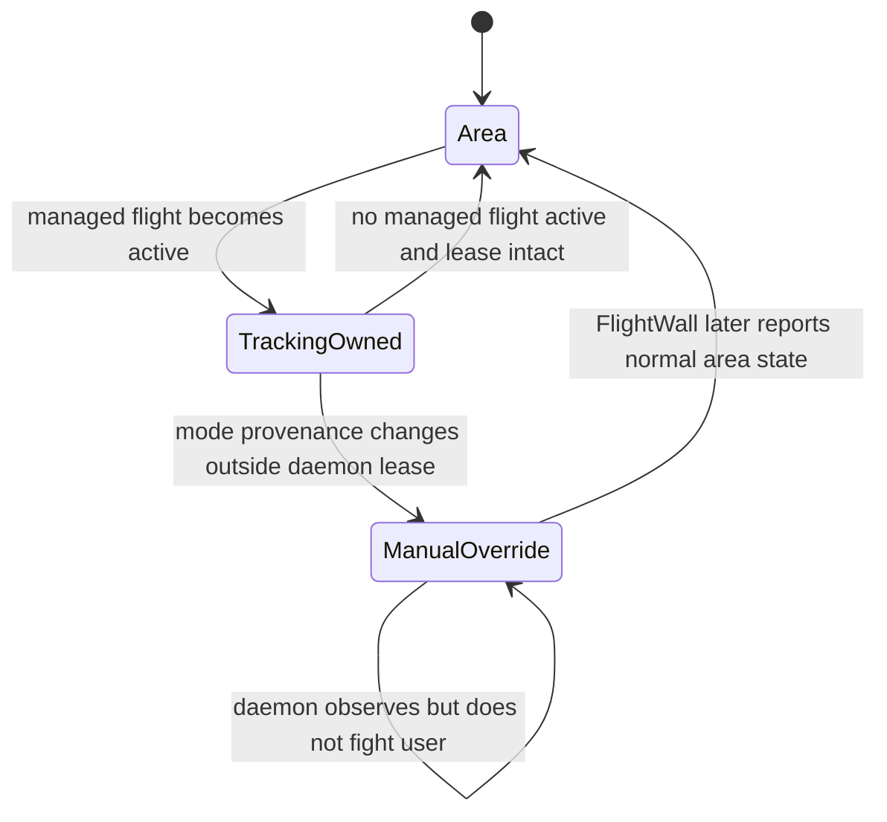
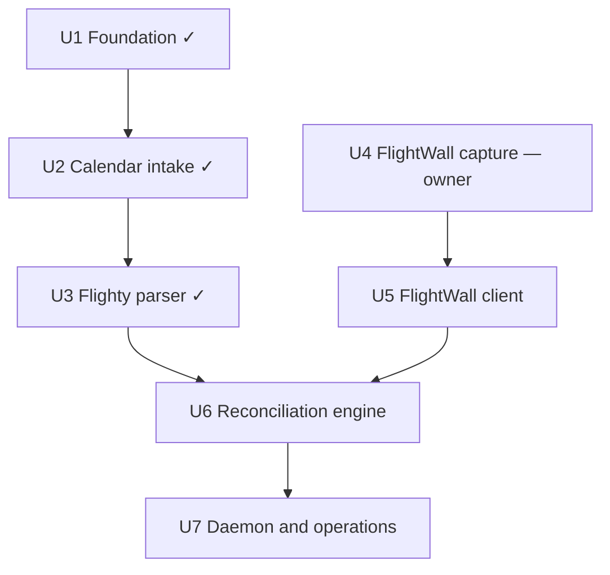

# feat: Sync Flighty Friends to FlightWall Mini

## Status

| Unit | State | Evidence |
| --- | --- | --- |
| U1 Foundation and state | done | `b9ad5c7`; config moved to pydantic in `3e3122c` |
| U2 Google Calendar intake | done, verified live | `97f9a63`, `be1a3b0`, `b792263` |
| U3 Flighty event parser | done, verified live | `b87df2c` |
| U4 FlightWall contract capture | **blocked on the owner** | tooling and protocol in `d92d56c`, `388078c`; no fixtures captured |
| U5 FlightWall client | not started | gated by U4 |
| U6 Reconciliation engine | not started | gated by U5 |
| U7 Daemon and operations | not started | gated by U6 |

`mise run check` is green: 102 tests, 94% coverage, all hooks passing.

**The single remaining blocker is U4.** Nothing else in this plan can proceed until the owner
runs the capture in `docs/flightwall-api-discovery.md` and the capability gate there passes.

---

## Overview

Build a small Python service that reads Flighty Friends events from a dedicated Google Calendar, normalizes those events into flights, and safely reconciles them with the owner's FlightWall Mini. The service preserves manually tracked flights, temporarily switches the wall from Area Tracking Mode to Flight Tracking Mode while a managed Friend flight is active, and restores the prior area mode afterward.

The calendar half is complete: a calendar-isolated service account reads the dedicated calendar, the parser turns real Flighty exports into stable flight records, and both fixture writers sanitize real data before it is committed. The FlightWall half has not started, because the commercial FlightWall app's backend contract is undocumented and must be observed from the owner's own device before any client is written.

---

## Problem Frame

Flighty already knows the owner's Friends' upcoming flights, but FlightWall requires those flights to be added separately. Manual copying is repetitive and easy to miss. Flighty's supported Calendar Export bridges the data to Google Calendar; the Linux service must then automate FlightWall without scraping Flighty, exposing credentials, deleting manual wall entries, or fighting the owner's display controls (see origin: `docs/brainstorms/2026-09-21-flighty-friends-flightwall-sync-requirements.md`).

---

## Requirements Trace

- R1. Read Flighty Friends events from one dedicated Google Calendar using read-only authorization. — **met (U2)**
- R2. Accept only events that identify a flight unambiguously with flight number and departure context. — **met (U3)**
- R3. Reconcile additions, updates, cancellations, and deletions without duplicates. — parser side met (U3); wall side pending (U6)
- R4. Include every Friend exported to the dedicated calendar in v1. — **met (U2, U3)**
- R5. Make unchanged sync runs idempotent. — pending (U6)
- R6. Make polling and lookahead configurable; default to a two-minute poll and seven-day lookahead. — **met (U1)**; poll loop pending (U7)
- R7. Persist explicit ownership of daemon-created FlightWall entries. — pending (U5, U6)
- R8. Never modify or remove manually created FlightWall entries. — pending (U4 gate, U6)
- R9. When FlightWall exposes authoritative activity and mode provenance, temporarily use Flight Tracking Mode for active managed flights, then restore Area Tracking Mode only while the daemon still owns that transition. — pending (U4 gate, U6); may become not applicable, see Open Questions
- R10. Keep all overlapping active Friend flights available. — parser side met (U3); wall side pending (U4 gate, U6)
- R11. Run unattended under systemd with restart behavior and actionable logs. — pending (U7)
- R12. Keep Google and FlightWall credentials out of source control and logs. — Google side met (U1, U2); FlightWall side pending (U5)
- R13. Provide an authoritative dry run when both sources are available and a clearly provisional, non-mutating local-intent report when FlightWall is unavailable. — pending (U6, U7)
- R14. Treat incomplete or failed upstream reads as non-authoritative and perform zero FlightWall mutations from them. — calendar side met (U2, U3); wall side pending (U5, U6)

**Origin actors:** A1 (owner), A2 (Flighty Friend), A3 (Flighty), A4 (Linux sync service), A5 (FlightWall Mini)

**Origin flows:** F1 (sync an upcoming Friend flight), F2 (display an active Friend flight), F3 (return to normal area tracking)

**Origin acceptance examples:** AE1 (calendar updates remain idempotent), AE2 (manual entries survive deletion), AE3 (overlapping flights and mode restoration), AE4 (dry-run and failure safety)

---

## Scope Boundaries

- Support one dedicated Google Calendar and all Friends exported into it.
- Do not scrape Flighty or use an undocumented Flighty API.
- Do not modify FlightWall firmware or replace its aircraft-data providers.
- Use only the owner's FlightWall account, device, and authenticated app requests.
- Do not build a dashboard, multi-user service, notification system, or per-Friend rules in v1.
- Do not promise compatibility with an undocumented FlightWall backend beyond the captured and tested contract.
- Do not automate CAPTCHA, device enrollment, or account recovery.

### Deferred to Follow-Up Work

- Per-Friend include/exclude rules and custom display windows.
- Support for multiple Google calendars or multiple FlightWall devices.
- A supported vendor integration if TheFlightWall publishes an API after v1.
- Replacing the `isinstance` chain in `calendar.py` with a `GoogleEvent(BaseModel, extra="allow")` once the parser contract has been stable for a while.

---

## Context & Research

### Established Code and Patterns

Later units must fit the conventions the first three units set:

- `src/` layout with relative imports inside `src/flighty_wall/`; frozen dataclasses in `models.py` for internal values; `typing.Protocol` at every external boundary (`CalendarGateway`, `_DiscoveryModule`) so tests inject fakes without patching.
- `config.py` is nested pydantic (`AppConfig.google/.service/.storage/.calendar_limits`) with `strict=True`, `extra="forbid"`, range bounds in `Field`, and filesystem probes (`require_private_file`, state-parent check) run after validation, outside the model. New settings go in a new nested table, not a flat key.
- `cli.py` is a click group. Dependencies travel through `ctx.obj` as the frozen `Deps` dataclass; tests use `CliRunner().invoke(cli, [...], obj=Deps(...))`. Exit code 2 means config/usage error or a non-authoritative result, and nothing is written on exit 2.
- `CalendarReader.read_snapshot()` returns a `Snapshot` whose `authority` is explicit. A bound breach, request failure, or partial page yields a typed reason string, never a partial event list. Reconciliation must consume `authority`, never infer it from emptiness.
- `parser.parse_cycle()` is pure. The flight key is `DESIGNATOR:ORIGIN:UTC-departure-date`, carrying the set of contributing Google event IDs. Any Flighty-like event without an authoritative interpretation makes the whole cycle non-authoritative.
- All redaction rules live in `redaction.py` and are shared by both fixture writers. Fixtures are written atomically at mode `0600`. JSON goes through `orjson` only; the stdlib `json` module is banned by ruff.
- `mise run check` is the gate: prek hooks (ruff `ALL`, mypy strict, pyright strict, tombi, yamlfmt, actionlint, zizmor, yamllint) plus `pytest --cov` (floor 80%) plus `deptry`.

### Institutional Learnings

- A sanitizer cannot be trusted until it has processed real data. The U2 live capture found two leaks (`flighty://` deeplinks, `iCalUID`) that mocked tests had missed. The U4 sanitizer has only seen synthetic HARs; its gate row must be re-checked by hand once real fixtures exist.
- Flighty's export carries invisible characters in `summary`: `U+00A0` between carrier and number, `U+200B` around the route arrow. Any new text handling on calendar data must normalize both first.
- Google API success proves Google readability, not Flighty freshness. Observation time and each event's `updated` are separate fields and must stay separate in diagnostics.

### External References

- Flighty officially supports exporting Friends' flights with the Friend's name and standard flight information: https://flighty.com/help/calendar-export
- Flighty's calendar troubleshooting recommends isolated calendars to prevent duplicate import/export loops: https://flighty.com/help/troubleshoot-calendar-sync
- FlightWall supports tracked flights by flight number, callsign, or tail number, separates Flight Tracking Mode from Area Tracking Mode, and displays up to five flights at a time: https://theflightwall.com/products/flightwall-mini-flight-tracking-led-display
- The public FlightWall OSS project is a DIY ESP32 build with no companion app or local API; it does not document the commercial app backend: https://github.com/AxisNimble/TheFlightWall_OSS
- Google documents service-account credentials for server-to-server access: https://developers.google.com/identity/protocols/oauth2/service-account
- Google documents explicit calendar sharing and access roles: https://developers.google.com/workspace/calendar/api/concepts/sharing
- Google documents `events.list` pagination, cancellation behavior, and time-window filters: https://developers.google.com/workspace/calendar/api/v3/reference/events/list
- Mitmproxy documents installing its local certificate authority for traffic inspection on devices the operator controls: https://docs.mitmproxy.org/stable/concepts/certificates/
- Android documents why apps may reject user-installed certificate authorities and how network security policy affects inspection: https://developer.android.com/privacy-and-security/security-config

---

## Key Technical Decisions

- **Python 3.11+, `pyproject.toml`, `uv.lock`; libraries at the edges, stdlib in the middle:** `click` owns argument parsing, `pydantic` owns parsing TOML into typed config, `orjson` owns JSON. Domain values stay as frozen dataclasses; `tomllib`, `zoneinfo`, `sqlite3`, and `logging` come from the standard library.
- **One long-running process supervised by systemd:** The process polls on a monotonic schedule; systemd owns boot startup, restart policy, filesystem permissions, and log collection.
- **Calendar-isolated Google service account:** Only the dedicated Flighty calendar is shared, read-only, with a service account requesting `calendar.readonly`. A personal refresh token would reach every calendar in the owner's account; Google scopes themselves are not calendar-bound.
- **Bounded full-window reads instead of Calendar sync tokens:** A two-minute poll over the next seven days is small for a dedicated calendar. Page, event, field-length, and total-byte caps prevent a calendar writer from exhausting the daemon; exceeding any cap makes the cycle non-authoritative.
- **Cycle-wide fail-closed parsing:** Any unrecognized or ambiguous event that could be a Flighty export makes the cycle non-authoritative for all wall mutations. The sanitized real export is the parser's contract fixture.
- **FlightWall capability gate before contract-specific code:** The captured contract must prove complete list/mode reads, stable identifiers, simultaneous flights, authoritative activity, safe conditional deletion and mode provenance, recoverable uncertain mutations, capacity behavior, and reschedule semantics. A missing capability stops implementation and returns for a scope decision; it does not license a weaker guarantee.
- **Capacity of five is a normal condition:** The vendor states the Mini displays up to five flights at a time. Reconciliation must plan for being at capacity without treating it as an error and without ever evicting an entry the daemon does not own.
- **Isolated FlightWall adapter:** Endpoint, authentication, headers, payloads, identifiers, and error semantics come only from the owner's authorized capture. Production requires normal TLS verification and an allowlisted hostname; capture trust never reaches the daemon.
- **SQLite ownership journal after contract evidence:** Generic storage scaffolding exists; remote IDs, pending operations, aggregated source references, and mode provenance are finalized only after the gate passes. Ambiguous remote entries are never adopted or deleted.
- **Plan-then-apply reconciliation:** Authoritative calendar and wall snapshots produce the executable plan. An offline dry run emits only a clearly labeled provisional calendar-and-journal intent report.
- **Provenance-backed mode lease, if modes are exclusive:** Automatic restoration requires revision, actor, lease-token, or conditional-write evidence from FlightWall. If the capture shows area tracking and tracked flights coexist on one display, the lease is unnecessary and R9 collapses to "add and remove flights".
- **Privacy-safe logs and state:** Log event IDs, normalized flight identifiers, action types, and error classes. Never log credentials, reservation codes, seat numbers, full descriptions, raw captures, or Friend names by default.

---

## Open Questions

### Resolved

- **How should Flighty data reach Linux?** Through Flighty's supported export to a dedicated Google Calendar. Verified live 2026-09-22.
- **How should Google Calendar be read?** A service account with read-only sharing on only the Flighty calendar. Verified live 2026-09-22; no personal token is stored.
- **What is the exact Flighty event shape?** Recorded in `tests/fixtures/google_calendar/README.md` from a real capture: `"<Friend>: ✈ DUB→BCN • VY 8721"` in `summary` with `U+00A0`/`U+200B`, structured `description`, `start`/`end` with explicit time zones, un-padded flight numbers.
- **What are the polling defaults?** 120 seconds and seven days, bounded to 30–86 400 seconds and 1–30 days in `config.py`.
- **How should ambiguous parsing affect safety?** The whole cycle becomes non-authoritative and permits no wall mutation. Implemented in U3.
- **Is there a documented FlightWall interface that avoids the capture?** No. The vendor offers no API, webhooks, or integrations; the OSS project is a different device with no app.

### Open — settled only by the U4 capture

- **Are area tracking and flight tracking mutually exclusive?** The plan assumes yes. "Displays up to 5 flights at a time" suggests they may share one list. If they coexist, U6 drops the mode lease and R9 is not applicable.
- **What identifier format does the wall accept?** The parser produces `VY8721`; the wall may want `VY 8721`, `VY8721`, or a callsign. Flighty does not zero-pad (`BA 5`).
- **Does the wall distinguish manual entries from app-added ones?** If not, ownership rests entirely on the daemon's own journal of returned IDs.
- **What are the delete and mode-write preconditions?** Conditional delete needs a stable ID and ideally a revision/ETag; mode restore needs actor or lease evidence. Absence of either blocks the related automation.
- **What happens at capacity and after landing?** Rejection, eviction, or silent drop at six; hold, drop, or error after landing.
- **Certificate pinning:** If the app rejects a user CA, follow §5 of the discovery document: inspect the owned APK, then ask the vendor, then return for a scope decision. Never patch TLS.
- **Contract drift, rate limits, and token lifetime:** Derive from captured responses. Unknown fingerprints force read-only mode until recapture.

---

## Output Structure

```text
.
├── pyproject.toml, uv.lock, mise.toml, mise.lock, .python-version
├── .pre-commit-config.yaml, .yamlfmt.yaml, .yamllint.yaml, tombi.toml
├── .github/workflows/ci.yml
├── LICENSE, NOTICE, README.md, config.example.toml
├── docs/
│   ├── brainstorms/2026-09-21-flighty-friends-flightwall-sync-requirements.md
│   ├── plans/2026-09-21-001-feat-flighty-flightwall-sync-plan.md
│   ├── plans/2026-09-22-001-chore-click-pydantic-migration-plan.md   (done)
│   └── flightwall-api-discovery.md            (U4: findings tables empty until capture)
├── src/flighty_wall/
│   ├── __init__.py, __main__.py
│   ├── auth.py          service-account gateway
│   ├── calendar.py      bounded authoritative reads
│   ├── capture.py       HAR → sanitized FlightWall fixtures
│   ├── cli.py           click group: inspect-calendar, sanitize-capture
│   ├── config.py        pydantic AppConfig
│   ├── models.py        frozen domain values
│   ├── parser.py        Flighty event → Flight, fail-closed
│   ├── redaction.py     shared redaction rules
│   ├── state.py         SQLite bootstrap, permissions, atomic metadata
│   ├── flightwall.py    (U5)
│   ├── reconcile.py     (U6)
│   └── service.py       (U7)
├── systemd/flighty-wall.service               (U7)
└── tests/
    ├── fixtures/google_calendar/{README.md, friend-flight.json, cancelled-flight.json}
    ├── fixtures/flightwall/README.md          (fixtures arrive with U4)
    ├── test_auth.py, test_calendar.py, test_capture.py, test_cli.py,
    ├── test_config.py, test_parser.py, test_redaction.py, test_state.py
    ├── test_flightwall.py                     (U5)
    ├── test_reconcile.py                      (U6)
    └── test_service.py                        (U7)
```

Setup documentation lives in `README.md`; the separately planned `docs/setup.md` was folded into it.

---

## High-Level Technical Design

> *Directional guidance for review, not implementation specification.*



Each poll produces one of three outcomes:

1. **Authoritative snapshot:** Every bounded calendar page plus the complete FlightWall tracking list, mode state, and required provenance reads succeed and validate against the captured contract. The service may plan mutations.
2. **Non-authoritative snapshot:** Any source read, parser authority check, bound, authentication step, contract fingerprint, or required provenance check fails. The service logs the failure and performs zero FlightWall mutations.
3. **Provisional offline dry run:** Calendar and journal data describe local intent, but every action that depends on current FlightWall state is labeled unknown and cannot be applied.

Mode lifecycle — **applies only if U4 shows the two modes are mutually exclusive**:



---

## Implementation Units



- [x] U1. **Package, configuration, domain models, durable state** — `b9ad5c7`, config rewritten with pydantic in `3e3122c`.

  Landed: `pyproject.toml`, `config.example.toml`, `config.py` (nested `AppConfig`), `models.py`, `state.py` (schema-versioned SQLite with `0700`/`0600` checks including WAL/SHM, atomic metadata), `tests/test_config.py`, `tests/test_state.py`. FlightWall-specific tables were deliberately not created; they arrive in U5/U6 after the gate.

- [x] U2. **Google authorization and authoritative calendar snapshots** — `97f9a63`, `be1a3b0`, `b792263`. Verified live 2026-09-22.

  Landed: `auth.py`, `calendar.py`, the `inspect-calendar` command with `--lookahead-days`/`--lookback-days` (up to 365) for captures beyond the daemon window, `tests/fixtures/google_calendar/friend-flight.json` from two real Friends' flights. Carry forward: observation time and event `updated` are separate fields; a bound breach or failed page is a typed non-authoritative reason, never an empty calendar.

- [x] U3. **Normalize and validate Flighty calendar events** — `b87df2c`. Verified live 2026-09-22 against real, unredacted summaries: two events, two flights, zero unrecognized.

  Landed: `parser.py`, `tests/fixtures/google_calendar/cancelled-flight.json`, `tests/test_parser.py`. Decisions U6 depends on:
  - Flight key `DESIGNATOR:ORIGIN:UTC-departure-date`: a same-day delay updates one entry; a move to another day yields a new key. Contributing event IDs attach to the key; the freshest `updated` wins on a departure-instant disagreement.
  - A codeshare (one leg claimed by two designators at the same instant) makes the cycle non-authoritative; the export carries no codeshare data to disambiguate.
  - The ✈ glyph is a required Flighty marker: if Flighty drops its footer, a flight fails the cycle loudly instead of vanishing from the wall.
  - Failure reasons carry the Google event ID and never event text.

---

- [ ] U4. **Capture and document the authorized FlightWall contract** — **owner action outstanding**

**Goal:** Observe the exact commercial-app requests needed to list, add, remove, and display tracked flights, and prove the capability gate, before any code targets the backend.

**Requirements:** R7, R8, R9, R10, R12, R14; F2, F3

**Dependencies:** None on code. Requires the owner's Android device or an owned emulator, the owner's FlightWall account and wall, and about 90 minutes.

**Already done (`d92d56c`, `388078c`):**
- `sanitize-capture` (`capture.py`) turns a HAR export into one fixture per request: every header and query value dropped, body values redacted by key name and by pattern via `redaction.py`, oversized or non-JSON bodies reduced to size and MIME type, `--host` allowlist with host discovery when nothing matches.
- `docs/flightwall-api-discovery.md`: vendor baseline (§1), safety rules and setup/teardown (§2), fourteen controlled sequences (§3), empty findings tables (§4), pinning fallback (§5), provenance table (§6), ten-row capability gate (§7).
- `tests/fixtures/flightwall/README.md`: what the sanitizer removes, what may never be committed, target file names.
- Confirmed without a capture: there is no public API; the OSS project is a different device; the Mini displays up to five flights at a time.

**Remaining — owner:**
1. Follow §2 setup in the discovery document. Record the app version and platform immediately.
2. Record the fourteen sequences in §3 separately. Sequences 9 (capacity) and 12 (interrupted mutation) are the likeliest gate failures; do not skip them.
3. Export the HAR to `captures/` and run `sanitize-capture` once without `--host` to list hosts, then again with the FlightWall hosts and one `--redact-term` per Friend name and device label.
4. Read every produced fixture by hand. Delete the raw HAR and proxy flows, remove the CA from the device, sign out, rotate the password if a login was captured.
5. Fill §4, §6, and §7 of the discovery document from observed requests only. Rename fixtures to the operation they prove and commit them.

**Gate outcome:** U5 starts only when all ten §7 rows read **pass**. Any failure returns to the owner for a scope decision (manual-entry-only workflow, or keep U1–U3 as a Flighty normalisation tool); it does not license a weaker manual-entry or mode-safety guarantee.

**Verification:**
- A sanitized, replay-safe fixture exists for each required operation, each with a provenance row.
- §4 answers the four design questions in §1: mode exclusivity, post-landing behaviour, manual/app distinction, identifier stability.
- No committed or retained artifact contains a usable token, device secret, CA key, personal location, or account identifier — re-checked by hand, not by the sanitizer's tests.

---

- [ ] U5. **Implement the defensive FlightWall client**

**Goal:** Encapsulate the captured contract behind a validated client that exposes only the operations reconciliation needs.

**Requirements:** R5, R7, R8, R9, R10, R12, R14; F2, F3

**Dependencies:** U4 gate passed.

**Files:**
- Create: `src/flighty_wall/flightwall.py`
- Modify: `src/flighty_wall/config.py` — add a `[flightwall]` table: allowlisted host, credential file path, request timeout; probed with `require_private_file` like the Google key
- Modify: `config.example.toml`
- Modify: `src/flighty_wall/state.py` — remote ownership, aggregated source references, pending operations, mode provenance (only fields U4 proved)
- Modify: `src/flighty_wall/cli.py` — add `probe-wall`, a read-only authoritative snapshot command
- Modify: `pyproject.toml` — add `httpx`
- Test: `tests/test_flightwall.py`, `tests/test_state.py`, `tests/test_cli.py`

**Approach:**
- `WallSnapshot` is authoritative only after complete pagination plus successful mode, activity, provenance, and contract-fingerprint validation — the same shape as `calendar.Snapshot`.
- Typed add, conditional remove-by-exact-ID/revision, and conditional mode operations exist only for capabilities U4 proved. If modes coexist, there is no mode operation.
- Designator formatting (`VY8721` vs `VY 8721` vs callsign) is a single explicit mapping from the U3 designator, taken from §4.2.
- HTTPS with normal certificate validation, allowlisted captured hostname, no credential forwarding across redirects. Capture CA and `verify=False` are rejected at config load.
- Bounded timeouts; retries only for reads and demonstrably idempotent mutations. A mutation with unknown outcome is surfaced as unknown, never retried blindly.
- Distinct errors for authentication, authorization, rate limit, transport, and contract drift. An unknown fingerprint forces read-only mode.

**Test scenarios:**
- List responses distinguish manual entries from daemon-owned IDs without mutating either.
- Add, remove-by-exact-ID, and mode responses produce typed outcomes matching fixtures.
- Duplicate-add or existing-equivalent response is explicit and never grants ownership of a manual entry.
- Timeout after a mutation yields unknown outcome; 401/403 yields reauthentication; 429/5xx yields retryable with delay metadata.
- Failure on page two, failed mode/activity read, or missing provenance makes the snapshot non-authoritative and permits zero mutating calls.
- Missing/renamed required fields or unknown fingerprint forces read-only handling.
- Cross-host redirects, disabled TLS validation, and capture-CA configuration are rejected; logging redacts authorization, device credentials, location, and personal fields.

**Verification:**
- All captured fixtures pass without network access, including incomplete-pagination and drift fixtures.
- `probe-wall` produces one authoritative snapshot against the real wall without changing it.
- Mutating probes require an explicit operator flag and report exact before/after state.

---

- [ ] U6. **Build ownership-safe reconciliation and mode leasing**

**Goal:** Compute and apply idempotent calendar-to-wall changes while preserving manual entries and user control.

**Requirements:** R3, R4, R5, R6, R7, R8, R9, R10, R13, R14; F1, F2, F3; AE1–AE4

**Dependencies:** U5

**Files:**
- Create: `src/flighty_wall/reconcile.py`
- Test: `tests/test_reconcile.py`

**Approach:**
- One authoritative calendar snapshot plus owned state plus one authoritative `WallSnapshot` yield a deterministic ordered action plan. Any non-authoritative input permits zero wall mutation.
- Consume U3's flight key as-is: aggregate all source event IDs per key; add once; retain while any source reference remains; remove only an exact owned ID using the captured precondition. A day change is a new key and therefore add-new-then-remove-old, in that order.
- Persist pending mutation intent before network calls; resolve it from a fresh `WallSnapshot` after success, timeout, or restart.
- An equivalent manual flight suppresses a duplicate add but is never adopted; the decision appears in dry-run and log output.
- At capacity (five), add only after a conclusively stale owned entry is removed; never evict a manual entry. Report unplaceable flights rather than forcing them.
- Use FlightWall's authoritative per-flight active status for mode decisions. No local activity windows.
- **If modes are exclusive:** acquire a lease only when the daemon changes Area to Tracking and receives provenance; restore Area only by conditional mutation against that provenance; any unverifiable or manual change releases the lease. **If modes coexist:** no mode logic at all.
- Authoritative dry-run and normal mode share the planner. With FlightWall unavailable, dry-run emits a separate provisional local-intent report with every remote-dependent action marked unknown.

**Test scenarios:**
- F1/AE1: repeated identical snapshots produce one add then nothing; a gate-only update produces no duplicate.
- F3/AE2: deleting a calendar event removes its exact owned entry and leaves a manual entry unchanged.
- F2/AE3: two overlapping active flights stay tracked; Area restores only after both inactive and provenance matches (or the scenario is not applicable if modes coexist).
- AE4: authoritative dry-run emits the executable plan without mutation; wall-outage dry-run emits provisional intent and changes no state.
- Any partial read, ambiguous event, incomplete pagination, failed mode read, bound breach, or drift invokes no mutation.
- Timeout-after-add then restart resolves the pending intent from wall state without duplicating and adopts ownership only when identity is unambiguous.
- Two Friends or a codeshare on one remote flight: removing one source leaves the entry while another remains.
- User changes mode away-and-back between polls: provenance mismatch releases the lease.
- Reschedule within a day updates one entry; to another day adds then removes.
- Full capacity: only a proven stale owned deletion frees a slot; no manual eviction; excess flights reported.
- One failed mutation stops dependent actions and records the incomplete operation.

**Verification:**
- The matrix proves idempotency, ownership isolation, overlap handling, capacity handling, dry-run parity, and crash recovery.
- No path can issue a delete for a remote ID absent from durable ownership state.

---

- [ ] U7. **Daemon lifecycle, remaining commands, systemd, end-to-end verification**

**Goal:** Make the service installable, observable, recoverable, and straightforward to operate on the Linux host.

**Requirements:** R6, R11, R12, R13, R14; all success criteria; AE4

**Dependencies:** U6

**Files:**
- Create: `src/flighty_wall/service.py`
- Create: `systemd/flighty-wall.service`
- Modify: `src/flighty_wall/cli.py` — add one-cycle dry run, one-cycle apply, and continuous `run`; `inspect-calendar`, `sanitize-capture`, and `probe-wall` already exist
- Modify: `README.md` — add install, first dry run, controlled first apply, service enablement, credential rotation, backup/retention, troubleshooting
- Test: `tests/test_service.py`, `tests/test_cli.py`

**Approach:**
- One synchronization engine behind CLI and daemon paths so dry-run and production cannot drift.
- Signal-aware shutdown and a monotonic loop; never start a second cycle while one runs.
- One host-wide lock shared by continuous mode, one-cycle apply, and pending-operation recovery. A competing mutating process exits busy with an actionable message; read-only inspection remains available.
- Introduce `logging` here, not before: `getLogger(__name__)` per module, configured once in the daemon entry point to stderr for the journal, level from config. `inspect-calendar` and `sanitize-capture` keep `click.echo` — they are user-facing diagnostics, not the service. Privacy rule applies: IDs, designators, action types, error classes; never credentials, reservation codes, seats, descriptions, or Friend names.
- Dedicated unprivileged user, `0700` state/config directories, `0600` credential/state files, restrictive umask, restart-on-failure, explicit writable paths, journal logging, `NoNewPrivileges`, empty capabilities, `ProtectSystem=strict`, `ProtectHome`, `PrivateTmp`, bounded tasks/memory where supported.
- Startup status line and per-cycle summary: counts and durations only.

**Test scenarios:**
- One-cycle dry run exits 0, prints stable action counts, never invokes a mutating client method.
- Continuous mode schedules one cycle at a time and honors the interval with an injected clock/sleeper.
- Fixture-backed calendar plus fixture-backed wall produce expected plans through the real click boundary.
- Calendar auth failure, wall auth failure, and SQLite failure produce distinct non-zero exits and journal-safe diagnostics.
- SIGTERM during sleep exits cleanly; during a cycle completes or checkpoints first.
- A cycle longer than the interval does not overlap the next.
- While the daemon holds the lock, apply and recovery fail busy without mutation; inspection still works.
- Environment, status output, and exceptions reveal no credential values or sensitive calendar fields.
- `systemd-analyze security` meets the documented baseline or records a justified exception.

**Verification:**
- A new Linux install completes authorization, dry-run, controlled apply, reboot, and automatic restart from `README.md` alone.
- systemd reports healthy status and one concise summary per cycle.
- End-to-end fixture tests cover AE1–AE4 without contacting Google or FlightWall.

---

## System-Wide Impact

- **Interaction graph:** Flighty updates Google Calendar; the service reads and parses events; reconciliation joins calendar state, SQLite ownership, wall state, and time; the FlightWall adapter performs mutations; systemd owns process lifecycle.
- **Error propagation:** Any incomplete calendar or wall read, parser ambiguity, bound breach, failed provenance check, or unknown contract fingerprint becomes non-authoritative. The service logs and retries later but performs zero wall mutation. Mutation uncertainty is journaled before further changes.
- **State lifecycle risks:** Crashes between remote mutation and local commit, duplicate source events for one flight, conditional-delete races, remote ID reuse, stale mode provenance, and the five-flight cap. Aggregated source references, pending intents, contract-backed preconditions, and authoritative re-reads address these conservatively.
- **API surface parity:** Inspection, probe, dry-run, one-shot apply, and daemon mode share configuration, parser, planner, state, and client boundaries.
- **Integration coverage:** Fixture-backed end-to-end tests prove cross-layer flows; one controlled live validation per external contract keeps routine tests offline.
- **Unchanged invariants:** Flighty remains the human-facing source of Friends and flights. FlightWall firmware, data providers, device enrollment, manually tracked entries, and unrelated settings remain untouched.

---

## Risks & Dependencies

| Risk | Mitigation |
| --- | --- |
| FlightWall changes its undocumented backend | Validate an allowlisted contract fingerprint; unknown versions force read-only mode until recapture and fixture validation. |
| FlightWall lacks a requirement-critical capability | U4 is a hard gate; stop and ask the owner to reduce scope rather than weaken manual-entry or mode-safety guarantees. |
| Area and tracking modes turn out to coexist | Design simplifies: U6 drops the lease, R9 becomes not applicable. Record the finding in §4 before U5 starts. |
| HTTPS interception leaks credentials or weakens production TLS | Ephemeral restricted capture environment, raw flows deleted, credentials rotated, CA removed; capture trust and disabled verification rejected at config load. |
| Flighty changes calendar event formatting | Characterization fixtures, cycle-wide fail-closed parsing, redacted diagnostics, `mise run fixture:calendar` to refresh. |
| Calendar or wall outage appears as an empty source | Authority is explicit on every snapshot; all non-authoritative inputs cause zero wall mutation. |
| Calendar writer submits hostile or excessive events | Private calendar ACL, calendar-isolated service account, candidate-shape validation, page/event/field/byte caps. |
| Flighty-to-Google export is delayed or stale | Observation time and event `updated` reported separately; API success never claims Flighty freshness. |
| Crash after remote mutation but before local commit | Persist pending intent first, then resolve against a fresh authoritative `WallSnapshot` before retrying. |
| Manual app changes race the daemon | Require conditional delete and mode provenance; if unavailable, block those behaviors instead of check-then-act. |
| Wall is at its five-flight cap | Plan around capacity; remove only conclusively stale owned entries; never evict a manual entry; report unplaceable flights. |
| Credentials or travel state leak from disk or backup | `0700` directories, `0600` files/WAL/SHM, atomic writes, redacted logs, encrypted backups, retention, secure deletion guidance. |
| Polling triggers rate limits | Seven-day bounded calendar query, mutate only on change, honor server retry guidance, configurable interval. |

---

## Success Metrics

- A new Friend flight exported by Flighty appears in the next successful calendar snapshot and is added to FlightWall once.
- Ten unchanged sync cycles produce zero FlightWall mutations after initial convergence.
- Calendar deletion removes only the exact daemon-owned entry; manual entries remain unchanged in all automated tests.
- Overlapping Friends' flights keep Flight Tracking Mode active until FlightWall reports the final managed flight inactive and the daemon's mode provenance remains valid — or, if modes coexist, both flights are simply present until inactive.
- Simulated Google, FlightWall, and process failures never trigger broad deletion or loss of ownership state.
- A clean Linux host reaches a successful dry run by following `README.md` without reading source code.

---

## Documentation / Operational Notes

- `README.md` carries all setup: Google calendar and service account (done), Flighty export (done), fixture capture (done), FlightWall capture (done, pending the owner running it), and — from U7 — daemon installation, first dry run, controlled first apply, credential rotation, backup, troubleshooting.
- `docs/flightwall-api-discovery.md` must record app version and capture date per fixture so future breakage can be compared with the known contract.
- Back up SQLite state only to encrypted, access-controlled storage; include WAL/SHM consistency, retention, restoration, and secure deletion procedures.
- First deployment sequence: pass the FlightWall capability gate → delete raw captures and rotate captured credentials → fixture tests → `probe-wall` read-only → review an authoritative dry run → one controlled apply → enable the daemon.

---

## Sources & References

- **Origin document:** [`docs/brainstorms/2026-09-21-flighty-friends-flightwall-sync-requirements.md`](../brainstorms/2026-09-21-flighty-friends-flightwall-sync-requirements.md)
- **Tooling migration (done):** [`docs/plans/2026-09-22-001-chore-click-pydantic-migration-plan.md`](2026-09-22-001-chore-click-pydantic-migration-plan.md)
- **Capture protocol and capability gate:** [`docs/flightwall-api-discovery.md`](../flightwall-api-discovery.md)
- Flighty Calendar Export: https://flighty.com/help/calendar-export
- Flighty Friends: https://flighty.com/help/flighty-friends
- Flighty calendar troubleshooting: https://flighty.com/help/troubleshoot-calendar-sync
- FlightWall Mini product and FAQ: https://theflightwall.com/products/flightwall-mini-flight-tracking-led-display
- FlightWall OSS project: https://github.com/AxisNimble/TheFlightWall_OSS
- Google service accounts: https://developers.google.com/identity/protocols/oauth2/service-account
- Google Calendar sharing: https://developers.google.com/workspace/calendar/api/concepts/sharing
- Google Calendar `events.list`: https://developers.google.com/workspace/calendar/api/v3/reference/events/list
- Mitmproxy certificates: https://docs.mitmproxy.org/stable/concepts/certificates/
- Android network security configuration: https://developer.android.com/privacy-and-security/security-config
