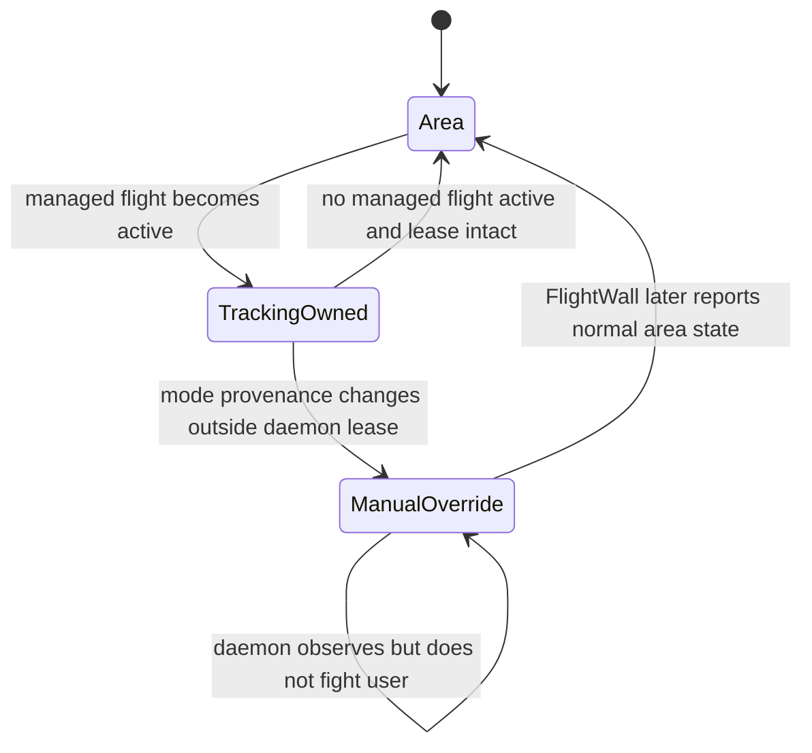
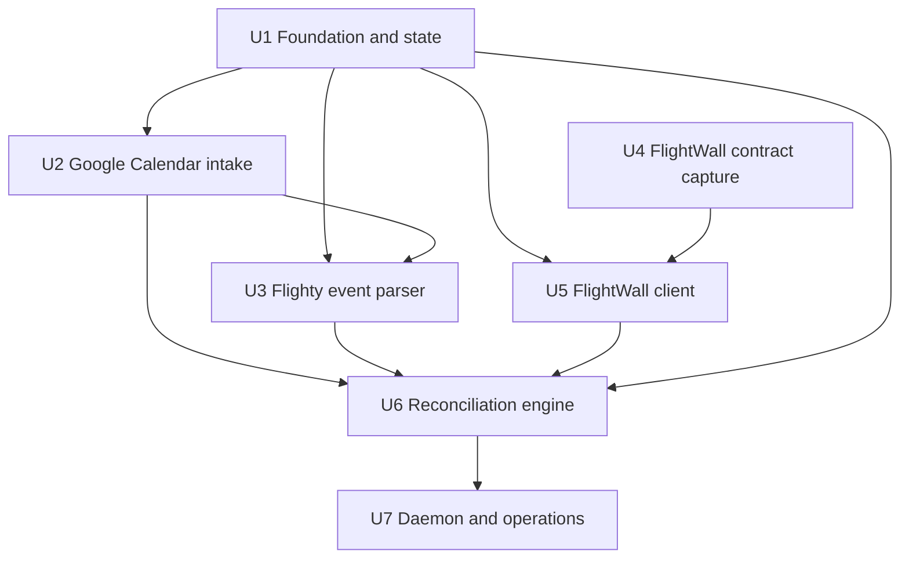

# feat: Sync Flighty Friends to FlightWall Mini

## Overview

Build a small Python service that reads Flighty Friends events from a dedicated Google Calendar, normalizes those events into flights, and safely reconciles them with the owner's FlightWall Mini. The service preserves manually tracked flights, temporarily switches the wall from Area Tracking Mode to Flight Tracking Mode while a managed Friend flight is active, and restores the prior area mode afterward.

The repository is greenfield. The highest-risk dependency is the commercial FlightWall app's undocumented backend contract. Implementation therefore starts with a bounded, authorized Android capture and records a sanitized contract before any production FlightWall client is written.

---

## Problem Frame

Flighty already knows the owner's Friends' upcoming flights, but FlightWall requires those flights to be added separately. Manual copying is repetitive and easy to miss. Flighty's supported Calendar Export can bridge the data to Google Calendar; the Linux service must then automate FlightWall without scraping Flighty, exposing credentials, deleting manual wall entries, or fighting the owner's display controls (see origin: `docs/brainstorms/2026-09-21-flighty-friends-flightwall-sync-requirements.md`).

---

## Requirements Trace

- R1. Read Flighty Friends events from one dedicated Google Calendar using read-only authorization.
- R2. Accept only events that identify a flight unambiguously with flight number and departure context.
- R3. Reconcile additions, updates, cancellations, and deletions without duplicates.
- R4. Include every Friend exported to the dedicated calendar in v1.
- R5. Make unchanged sync runs idempotent.
- R6. Make polling and lookahead configurable; default to a two-minute poll and seven-day lookahead.
- R7. Persist explicit ownership of daemon-created FlightWall entries.
- R8. Never modify or remove manually created FlightWall entries.
- R9. When FlightWall exposes authoritative activity and mode provenance, temporarily use Flight Tracking Mode for active managed flights, then restore Area Tracking Mode only while the daemon still owns that transition.
- R10. Keep all overlapping active Friend flights available.
- R11. Run unattended under systemd with restart behavior and actionable logs.
- R12. Keep Google and FlightWall credentials out of source control and logs.
- R13. Provide an authoritative dry run when both sources are available and a clearly provisional, non-mutating local-intent report when FlightWall is unavailable.
- R14. Treat incomplete or failed upstream reads as non-authoritative and perform zero FlightWall mutations from them.

**Origin actors:** A1 (owner), A2 (Flighty Friend), A3 (Flighty), A4 (Linux sync service), A5 (FlightWall Mini)

**Origin flows:** F1 (sync an upcoming Friend flight), F2 (display an active Friend flight), F3 (return to normal area tracking)

**Origin acceptance examples:** AE1 (calendar updates remain idempotent), AE2 (manual entries survive deletion), AE3 (overlapping flights and mode restoration), AE4 (dry-run and failure safety)

---

## Scope Boundaries

- Support one dedicated Google Calendar and all Friends exported into it.
- Do not scrape Flighty or use an undocumented Flighty API.
- Do not modify FlightWall firmware or replace its aircraft-data providers.
- Use only the owner's FlightWall account, device, and authenticated app requests.
- Do not build a dashboard, multi-user service, notification system, or per-Friend rules in v1.
- Do not promise compatibility with an undocumented FlightWall backend beyond the captured and tested contract.
- Do not automate CAPTCHA, device enrollment, or account recovery.

### Deferred to Follow-Up Work

- Per-Friend include/exclude rules and custom display windows.
- Support for multiple Google calendars or multiple FlightWall devices.
- A supported vendor integration if TheFlightWall publishes an API after v1.

---

## Context & Research

### Relevant Code and Patterns

- The repository contains only the origin requirements document, so there are no local application or test patterns to reuse.
- Use a conventional Python `src/` package layout, dependency injection at external boundaries, and fixture-driven contract tests.
- Keep calendar, parser, state, FlightWall transport, reconciliation, and process lifecycle as separate modules so the undocumented integration can change without rewriting the service.

### Institutional Learnings

- No `docs/solutions/` material or project-local engineering guidance exists in this greenfield repository.

### External References

- Flighty officially supports exporting Friends' flights with the Friend's name and standard flight information: https://flighty.com/help/calendar-export
- Flighty's calendar troubleshooting recommends isolated calendars to prevent duplicate import/export loops: https://flighty.com/help/troubleshoot-calendar-sync
- FlightWall supports tracked flights by flight number, callsign, or tail number and separates Flight Tracking Mode from Area Tracking Mode: https://theflightwall.com/products/flightwall-mini-flight-tracking-led-display
- The public FlightWall OSS project documents OpenSky and FlightAware data sources but not the commercial app backend: https://github.com/AxisNimble/TheFlightWall_OSS
- Google documents service-account credentials for server-to-server access: https://developers.google.com/identity/protocols/oauth2/service-account
- Google documents explicit calendar sharing and access roles: https://developers.google.com/workspace/calendar/api/concepts/sharing
- Google documents `events.list` pagination, cancellation behavior, and time-window filters: https://developers.google.com/workspace/calendar/api/v3/reference/events/list
- Mitmproxy documents installing its local certificate authority for traffic inspection on devices the operator controls: https://docs.mitmproxy.org/stable/concepts/certificates/
- Android documents why apps may reject user-installed certificate authorities and how network security policy affects inspection: https://developer.android.com/privacy-and-security/security-config

---

## Key Technical Decisions

- **Python 3.11+ with a `pyproject.toml`:** It is widely available on current Linux distributions and provides `tomllib`, `zoneinfo`, `sqlite3`, `dataclasses`, and mature Google/HTTP clients without a large runtime stack.
- **One long-running process supervised by systemd:** The process polls on a monotonic schedule; systemd owns boot startup, restart policy, filesystem permissions, and log collection.
- **Calendar-isolated Google service account:** Share only the dedicated Flighty calendar read-only with a service account and request `calendar.readonly`. This avoids granting a personal refresh token access to every calendar in the owner's account; Google scopes themselves are not calendar-bound.
- **Bounded full-window reads instead of Calendar sync tokens:** A two-minute poll over the next seven days is small for a dedicated calendar and naturally discovers events that enter the moving window. An event/page/byte cap prevents calendar writers from exhausting the daemon; exceeding any cap makes the cycle non-authoritative.
- **Cycle-wide fail-closed parsing:** Any unrecognized or ambiguous event that could be a Flighty export makes the cycle non-authoritative for all wall mutations. Known unrelated events may be ignored explicitly. A sanitized real Flighty export becomes the parser's contract fixture before rules are finalized.
- **FlightWall capability gate before contract-specific state:** The captured contract must prove complete list/mode reads, stable identifiers, simultaneous flights, authoritative activity, safe conditional deletion and mode provenance, recoverable uncertain mutations, capacity behavior, and reschedule semantics. Missing capabilities stop implementation and return for a scope decision.
- **Isolated FlightWall adapter:** The production endpoint, authentication, headers, payloads, identifiers, and error semantics come only from the owner's authorized capture. Production requires normal TLS verification and an allowlisted hostname; capture trust never reaches the daemon.
- **SQLite ownership journal after contract evidence:** Generic storage scaffolding lands first; remote IDs, pending operations, aggregated source references, and mode provenance are finalized only after the capability gate. Ambiguous remote entries are never adopted or deleted.
- **Plan-then-apply reconciliation:** Authoritative calendar and wall snapshots produce the executable plan. An offline dry run emits only a clearly labeled provisional calendar-and-journal intent report, with every remote-dependent action marked unknown.
- **Provenance-backed mode lease:** Automatic restoration requires revision, actor, timestamp, lease-token, or conditional-write evidence from FlightWall. Current-value comparison alone is insufficient; if provenance is unavailable, automatic mode control is blocked pending a user scope decision.
- **Privacy-safe logs and state:** Log event IDs, normalized flight identifiers, action types, and error classes. Do not log credentials, reservation codes, seat numbers, full calendar descriptions, raw captures, or Friend names by default.

---

## Open Questions

### Resolved During Planning

- **How should Flighty data reach Linux?** Through Flighty's supported export to a dedicated Google Calendar; no Apple bridge is required after export.
- **How should Google Calendar be read?** A dedicated service account receives read-only access to only the Flighty calendar; no personal Google refresh token is stored on Linux.
- **What are the initial polling defaults?** Poll every two minutes and manage flights scheduled within the next seven days; both values remain configurable.
- **How should ambiguous parsing affect safety?** Any ambiguous event that could be Flighty data makes the whole cycle non-authoritative and permits no wall mutation.
- **How should manual FlightWall entries be protected?** Persist only daemon-created remote IDs and aggregated source references, require safe delete preconditions, and never delete an unowned or ambiguous entry.
- **How should display mode be restored?** Only with FlightWall-provided provenance or conditional-write evidence that the daemon still owns the transition; otherwise automatic mode control does not ship.
- **What should dry-run report during a wall outage?** A provisional local-intent report that labels all remote-dependent additions, removals, and mode actions unknown; it is not the executable action plan.

### Deferred to Implementation

- **Exact Flighty event shape:** Capture and sanitize real exported events before finalizing summary/description parsing. The parser must remain fail-closed if the shape differs.
- **Exact FlightWall app contract:** Capture list/add/remove/mode requests from the owner's Android app. Do not implement guessed endpoints or authentication.
- **Capability gate result:** Prove complete pagination, stable identifiers, two simultaneous tracked flights, authoritative active status, conditional delete/mode semantics, mutation recovery, capacity behavior, and reschedule/replacement semantics. Stop and return for a scope decision if any requirement-critical capability is missing.
- **Certificate pinning:** If the app rejects a user CA, use an owned ephemeral emulator with appropriate test trust or inspect the APK for contract metadata. If a safe authorized capture remains impossible, stop and request vendor API access rather than shipping speculative automation.
- **Remote ownership markers:** Prefer a server-supported client tag if exposed. Otherwise require returned remote IDs plus safe conditional mutation semantics; entries that cannot be matched safely become non-destructive orphans requiring manual review.
- **Contract drift, rate limits, and token lifetime:** Derive these from captured responses. Unknown contract fingerprints force read-only mode until recapture and fixture validation; rate limits and expiry become typed operational states.

---

## Output Structure

```text
.
├── pyproject.toml
├── README.md
├── config.example.toml
├── .gitignore
├── docs/
│   ├── brainstorms/
│   │   └── 2026-09-21-flighty-friends-flightwall-sync-requirements.md
│   ├── plans/
│   │   └── 2026-09-21-001-feat-flighty-flightwall-sync-plan.md
│   ├── flightwall-api-discovery.md
│   └── setup.md
├── src/
│   └── flighty_wall/
│       ├── __init__.py
│       ├── __main__.py
│       ├── auth.py
│       ├── calendar.py
│       ├── cli.py
│       ├── config.py
│       ├── flightwall.py
│       ├── models.py
│       ├── parser.py
│       ├── reconcile.py
│       ├── service.py
│       └── state.py
├── systemd/
│   └── flighty-wall.service
└── tests/
    ├── fixtures/
    │   ├── flightwall/
    │   └── google_calendar/
    ├── test_auth.py
    ├── test_calendar.py
    ├── test_cli.py
    ├── test_config.py
    ├── test_flightwall.py
    ├── test_parser.py
    ├── test_reconcile.py
    ├── test_service.py
    └── test_state.py
```

The tree is a scope declaration, not a requirement to preserve every filename if implementation reveals a simpler equivalent boundary.

---

## High-Level Technical Design

> *This illustrates the intended approach and is directional guidance for review, not implementation specification. The implementing agent should treat it as context, not code to reproduce.*


Each poll produces one of two outcomes:

1. **Authoritative snapshot:** Every bounded calendar page plus the complete FlightWall tracking list, mode state, and required provenance reads succeed and validate against the captured contract. The service may plan mutations.
2. **Non-authoritative snapshot:** Any source read, parser authority check, bound, authentication step, contract fingerprint, or required provenance check fails. The service logs the failure and performs zero FlightWall mutations—no add, update, remove, or mode change.
3. **Provisional offline dry run:** Calendar and journal data may still describe local intent, but every action that depends on current FlightWall state is labeled unknown and cannot be applied.

Mode lifecycle:



---

## Implementation Units



- [x] U1. **Establish package, configuration, domain models, and durable state**

**Goal:** Create the greenfield Python package and the safe local foundation used by every integration.

**Requirements:** R5, R6, R7, R11, R12, R13, R14

**Dependencies:** None

**Files:**
- Create: `pyproject.toml`
- Create: `.gitignore`
- Create: `config.example.toml`
- Create: `src/flighty_wall/__init__.py`
- Create: `src/flighty_wall/config.py`
- Create: `src/flighty_wall/models.py`
- Create: `src/flighty_wall/state.py`
- Test: `tests/test_config.py`
- Test: `tests/test_state.py`

**Approach:**
- Define immutable domain values for source events, normalized flights, planned actions, and sync outcomes without guessing FlightWall-specific identifiers or provenance fields.
- Load non-secret settings from TOML and secret file paths from deployment configuration; validate calendar ID, poll interval, lookahead, state path, snapshot bounds, and dry-run mode at startup.
- Bootstrap SQLite with schema versioning and generic metadata only. Finalize remote ownership, pending-operation, and mode-provenance records in U5/U6 after U4 proves the contract.
- Require daemon-owned directories to be mode `0700` and credential/state files—including SQLite WAL/SHM siblings—to be mode `0600`; updates must be atomic.
- Make the clock and external clients injectable so tests do not depend on wall time or live services.

**Execution note:** Implement state transitions test-first because crash recovery and ownership are safety-critical.

**Patterns to follow:**
- Standard Python `src/` package layout and `pyproject.toml` metadata.
- Standard-library `dataclasses`, `tomllib`, `sqlite3`, `zoneinfo`, and structured `logging` where practical.

**Test scenarios:**
- Happy path: valid example configuration loads typed values and applies two-minute/seven-day defaults when optional values are omitted.
- Edge case: zero/negative polling intervals, invalid time zones, or an unwritable state location fail before the service starts.
- Happy path: the schema version and generic metadata survive closing and reopening the SQLite store.
- Error path: an interrupted atomic metadata update leaves the prior committed state readable after restart.
- Security: state, WAL/SHM siblings, and credential files reject broader-than-configured permissions at startup.
- Security: serialized state and diagnostic representations do not contain configured credential values.

**Verification:**
- Package metadata installs cleanly in an isolated environment.
- Configuration failures are explicit and do not create partial state.
- State tests demonstrate crash-safe generic storage without prematurely encoding an unverified FlightWall contract.

---

- [ ] U2. **Add Google authorization and authoritative calendar snapshots**

**Goal:** Read every Flighty-exported event in the configured window from the dedicated Google Calendar without granting write access.

**Requirements:** R1, R3, R4, R6, R12, R14; F1

**Dependencies:** U1

**Files:**
- Create: `src/flighty_wall/auth.py`
- Create: `src/flighty_wall/calendar.py`
- Create: `tests/fixtures/google_calendar/README.md`
- Test: `tests/test_auth.py`
- Test: `tests/test_calendar.py`

**Approach:**
- Authenticate with a Google service account whose identity has read-only sharing on only the dedicated Flighty calendar; never store a personal-account refresh token.
- Resolve and validate the configured calendar ID during setup rather than using `primary`; document and verify that calendar sharing remains private and limited to the owner, Flighty, and the service account.
- On each poll, request timed events across the bounded management window, expand recurring instances, include cancelled events where useful, and consume every response page up to configured page, event, field-length, and total-byte caps.
- Return an authoritative snapshot only after complete pagination and bounds validation succeeds. A timeout, malformed response, denied scope, credential failure, over-limit result, or partial page sequence yields an explicit failed snapshot that reconciliation cannot use for any wall mutation.
- Record Google observation time separately from each event's `updated` value. API success proves Google readability, not that Flighty exported a recent upstream change; diagnostics must not present those as the same freshness signal.
- Add a privacy-safe inspection path that can produce a sanitized test fixture from real Flighty-exported events without reservation codes, seats, free-form descriptions, Friend names, or credential data.

**Execution note:** Start with mocked API pagination and failure tests before connecting a real Google account.

**Patterns to follow:**
- Google's official service-account and Calendar-sharing documentation with read-only scope.
- Google `events.list` pagination semantics; do not introduce sync-token complexity in v1.

**Test scenarios:**
- Happy path: one Friend flight inside the window appears once in the completed snapshot.
- Integration: multiple Google response pages are combined before the snapshot is marked authoritative.
- Edge case: timed events retain their explicit source time zone and are normalized without assuming the Linux host's local zone.
- Edge case: all-day and unrelated events remain available for parser rejection rather than crashing the reader.
- Error path: a failure on page two returns a non-authoritative result and no partial event set is exposed for destructive reconciliation.
- Error path: denied or revoked service-account access produces an actionable sharing/credential status without logging keys.
- Security: too many pages/events, oversized fields, or excessive total bytes makes the snapshot non-authoritative and causes zero wall mutations.
- Edge case: a delayed or stale event exposes separate observation and event-update timestamps without claiming Flighty's export is fresh.
- Security: fixture generation removes Friend names, booking references, seat numbers, descriptions, and credentials while preserving structural fields needed by tests.

**Verification:**
- The inspection path can identify the dedicated calendar and produce a sanitized Flighty event fixture.
- Live read access uses the service account and documented read-only scope against the explicitly shared calendar ID.
- No calendar failure or resource-limit breach can be represented as an authoritative empty calendar.

---

- [ ] U3. **Normalize and validate Flighty calendar events**

**Goal:** Convert known Flighty export shapes into stable flight records while rejecting ambiguous or unrelated calendar events.

**Requirements:** R2, R3, R4, R5, R10; F1; AE1

**Dependencies:** U1 and a sanitized fixture produced through U2

**Files:**
- Create: `src/flighty_wall/parser.py`
- Create: `tests/fixtures/google_calendar/friend-flight.json`
- Create: `tests/fixtures/google_calendar/cancelled-flight.json`
- Test: `tests/test_parser.py`

**Approach:**
- Base parsing rules on the sanitized real export rather than assumed title or description formatting.
- Normalize carrier code and flight number, departure airport, scheduled departure instant in UTC, source event ID, status, and optional non-sensitive display context.
- Use a stable physical-flight key based on flight identity and scheduled departure context, and associate it with the set of contributing Google event IDs so two Friends or codeshares do not create competing ownership records.
- Treat cancellation, reschedule, codeshare, duplicate event, malformed flight number, missing departure context, all-day event, and non-flight event as explicit outcomes rather than generic parse failures.
- Fail the entire cycle closed when an unknown or ambiguous event could be a Flighty export: log a redacted reason and permit zero wall mutation until every candidate event has an authoritative interpretation.

**Execution note:** Add characterization tests from the sanitized fixture before implementing parsing rules.

**Patterns to follow:**
- Pure transformation functions with no API or database access.
- Table-driven fixtures for format variants and boundary cases.

**Test scenarios:**
- Covers F1 / AE1. A valid exported Friend event becomes one normalized flight with stable identity across a gate or duration update.
- Edge case: two Friends' events for the same physical flight aggregate into one desired remote entry with two source references; removing one event retains the remote entry.
- Edge case: marketing and operating codeshares either aggregate deterministically from captured data or make the cycle non-authoritative; they never create two guessed flights.
- Edge case: departure and arrival in different time zones normalize correctly across daylight-saving transitions.
- Error path: a missing flight number, missing departure context, all-day event, or unrelated event produces no desired wall entry.
- Error path: an unknown Flighty-like format makes the whole cycle non-authoritative and invokes no wall mutation.
- Happy path: a cancelled event removes one source reference and makes the remote entry removable only after no authoritative source references remain.

**Verification:**
- Every captured Flighty event fixture has an explicit expected parse result.
- Parser output is deterministic and contains no reservation, seat, or Friend-name data unless explicitly enabled later.

---

- [ ] U4. **Capture and document the authorized FlightWall contract**

**Goal:** Establish evidence for the exact commercial app requests needed to list, add, remove, and display tracked flights before coding against the undocumented backend.

**Requirements:** R7, R8, R9, R10, R12, R14; F2, F3

**Dependencies:** None; this can run in parallel with U1–U3

**Files:**
- Create: `docs/flightwall-api-discovery.md`
- Create: `tests/fixtures/flightwall/README.md`
- Create: `tests/fixtures/flightwall/list-empty.json`
- Create: `tests/fixtures/flightwall/list-with-manual-and-tracked.json`
- Create: `tests/fixtures/flightwall/add-success.json`
- Create: `tests/fixtures/flightwall/remove-success.json`
- Create: `tests/fixtures/flightwall/mode-area.json`
- Create: `tests/fixtures/flightwall/mode-tracking.json`

**Approach:**
- Use an ephemeral owned Android emulator where possible and a localhost- or LAN-restricted HTTPS inspection proxy. Disable or protect raw-flow persistence, delete raw captures immediately after fixture sanitization, rotate captured credentials, and remove the interception CA afterward.
- Record controlled sequences for authentication/connect, complete paginated list and mode reads, two simultaneous future test flights, add/read/remove, reschedule or replacement, capacity behavior, uncertain mutation recovery, active-status transitions, mode changes, and restoration.
- Document method, host allowlist, path shape, HTTP verb, required headers by name, request/response field semantics, stable identifiers, revisions/ETags/actors, activity and mode provenance, pagination, capacity, token expiry, contract fingerprint, and observed errors.
- Sanitize fixtures before committing: remove credential values, device identifiers, names, precise home location, and unrelated account data. Preserve only the minimum contract shape.
- Treat U4 as a hard capability gate. U5/U6 may proceed only if the contract proves complete authoritative reads, stable IDs, simultaneous flights, safe conditional delete/mode semantics, recoverable mutation uncertainty, capacity behavior, and reschedule semantics. Any missing requirement-critical capability stops implementation and returns for a user scope decision.
- If certificate pinning or the app architecture prevents safe capture, inspect the owned APK for contract metadata or request vendor API access. Do not invent endpoints.

**Patterns to follow:**
- Contract-first reverse engineering against a device and account owned by the operator.
- Fixture provenance notes that state capture date, app version, and fields removed.

**Test scenarios:**
- Test expectation: none — this unit captures and documents an external contract rather than changing executable behavior. Fixture validation begins in U5.

**Verification:**
- A sanitized, replay-safe fixture exists for each required operation.
- The discovery document proves complete pagination, stable remote identity, safe mutation preconditions, two-flight support, active and mode provenance, capacity behavior, and recovery after an uncertain mutation.
- Each requirement-critical capability has a pass/fail result; any failure explicitly blocks U5/U6 rather than silently reducing guarantees.
- No committed or retained raw artifact contains a usable token, device secret, interception CA key, personal location, or account identifier.

---

- [ ] U5. **Implement the defensive FlightWall client**

**Goal:** Encapsulate the captured app contract behind a validated client that exposes only the operations reconciliation needs.

**Requirements:** R5, R7, R8, R9, R10, R12, R14; F2, F3

**Dependencies:** U1, U4

**Files:**
- Create: `src/flighty_wall/flightwall.py`
- Modify: `src/flighty_wall/state.py`
- Test: `tests/test_flightwall.py`
- Test: `tests/test_state.py`
- Modify: `tests/fixtures/flightwall/*.json` only if contract fixture normalization needs correction

**Approach:**
- Implement an authoritative WallSnapshot that requires complete pagination plus successful mode, activity, provenance, and contract-fingerprint validation before exposing data to reconciliation.
- Implement typed add, conditional remove-by-exact-ID/revision, and conditional mode operations only for capabilities proven by U4.
- Finalize SQLite tables for remote ownership, aggregated source references, pending operations, and mode provenance from the captured contract.
- Keep base URL, device/account identifiers, and credentials outside code. Require HTTPS, normal certificate validation, an allowlisted captured hostname, and no credential forwarding across redirects; never permit the capture CA or disabled verification in production.
- Use bounded request timeouts and conservative retries only for safe reads and demonstrably idempotent mutations. Never blindly retry a mutation whose outcome is unknown.
- Surface distinct errors for authentication, authorization, rate limits, transient transport failures, and contract/schema drift. An unknown fingerprint forces read-only mode until fixtures are recaptured and validated.

**Execution note:** Implement against sanitized captured fixtures before making live mutations.

**Patterns to follow:**
- One HTTP transport boundary using `httpx` with injected transport for deterministic tests.
- Strict response validation and redacted exception messages.

**Test scenarios:**
- Happy path: list responses distinguish manual remote entries from IDs already recorded as daemon-owned in local state without mutating either.
- Happy path: add, remove-by-exact-ID, and mode-change responses produce typed outcomes matching captured fixtures.
- Edge case: duplicate-add response or existing equivalent flight is represented explicitly and does not grant ownership of a pre-existing manual entry.
- Error path: timeout after an uncertain mutation yields an unknown outcome for reconciliation recovery, not an automatic retry.
- Error path: 401/403 produces a reauthentication error; 429 or server failure produces a retryable status with bounded delay metadata.
- Error path: failure on page two, failed mode/activity retrieval, or missing provenance makes WallSnapshot non-authoritative and permits zero mutating client calls.
- Error path: missing or renamed required response fields or an unknown fingerprint forces read-only contract-drift handling before any mutation.
- Security: cross-host redirects, disabled TLS validation, and capture-CA configuration are rejected; request/response logging redacts authorization, device credentials, location, and personal fields.

**Verification:**
- All captured fixtures pass contract tests without live network access, including incomplete pagination and drift fixtures.
- A live read-only probe produces one authoritative WallSnapshot without changing the device.
- Mutating probes require an explicit operator flag and proven conditional semantics, then report exact before/after state.

---

- [ ] U6. **Build ownership-safe reconciliation and mode leasing**

**Goal:** Compute and apply idempotent calendar-to-wall changes while preserving manual entries and user control.

**Requirements:** R3, R4, R5, R6, R7, R8, R9, R10, R13, R14; F1, F2, F3; AE1, AE2, AE3, AE4

**Dependencies:** U1, U2, U3, U5

**Files:**
- Create: `src/flighty_wall/reconcile.py`
- Test: `tests/test_reconcile.py`

**Approach:**
- Convert one authoritative calendar snapshot plus current owned state and one authoritative WallSnapshot into a deterministic ordered action plan. Any non-authoritative input permits zero wall mutation.
- Aggregate all source event IDs for each physical flight. Add a missing flight once, retain it while any source reference remains, and remove only an exact owned ID using the captured conditional precondition.
- Persist pending mutation intent before network calls and resolve it from a fresh authoritative WallSnapshot after success, timeout, or restart.
- If an equivalent manual flight already exists, suppress a duplicate but do not adopt ownership; surface that decision in dry-run/log output.
- Use FlightWall's authoritative per-flight active status for mode decisions and keep overlapping active flights in one desired set. Do not add configurable local activity windows in v1.
- Acquire a mode lease only when the daemon changes Area Tracking Mode to Flight Tracking Mode and receives provenance for that transition. Restore Area only by conditional mutation against that provenance; any unverifiable or manual change releases the lease.
- Authoritative dry-run and normal mode share the same planner. When FlightWall is unavailable, dry-run emits a separate provisional local-intent report with every remote-dependent action marked unknown.

**Execution note:** Implement the planner as pure logic test-first, then add the mutation executor and crash-recovery paths.

**Patterns to follow:**
- Functional core / imperative shell: pure desired-state planning around injected calendar, state, clock, and wall ports.
- Stable action ordering and explicit ownership checks at both planning and application boundaries.

**Test scenarios:**
- Covers F1 / AE1. Repeated identical snapshots produce one initial add and then no actions; a gate-only event update produces no duplicate.
- Covers F3 / AE2. Deleting a calendar event removes its exact daemon-owned remote entry while leaving a manual entry unchanged.
- Covers F2 / AE3. Two overlapping active Friend flights remain tracked; Area Tracking Mode restores only after FlightWall reports both inactive and the daemon's mode provenance still matches.
- Covers AE4. Authoritative dry-run emits the executable plan without mutation; wall-outage dry-run emits provisional local intent with remote actions unknown and leaves all state unchanged.
- Error path: a partial calendar read, any ambiguous Flighty-like event, incomplete wall pagination, failed mode/activity read, exceeded bound, or contract drift invokes no add, update, remove, or mode mutation.
- Recovery: a timeout after add followed by restart reads wall state, resolves the pending intent without creating a duplicate, and adopts ownership only when identity is unambiguous.
- Edge case: an equivalent manual flight suppresses a daemon add but is never deleted when the calendar event disappears.
- Edge case: two Friends or a marketing/operating codeshare share one remote flight; deleting or rescheduling one source leaves the entry while another authoritative source remains.
- Edge case: a user changes wall mode, including away-and-back between polls; mismatched provenance releases the lease and prevents restoration.
- Edge case: a rescheduled flight updates or atomically replaces only the associated owned entry according to the captured contract.
- Edge case: full FlightWall capacity uses only a proven atomic replacement or conclusively stale owned deletion; it never evicts a manual entry.
- Error path: one failed mutation stops dependent actions, records the incomplete operation, and leaves later cleanup for a fresh authoritative cycle.

**Verification:**
- The reconciliation test matrix proves idempotency, ownership isolation, overlap handling, dry-run parity, and crash recovery.
- No execution path can issue a delete for a remote ID absent from durable ownership state.

---

- [ ] U7. **Package the CLI, daemon lifecycle, setup, and end-to-end verification**

**Goal:** Make the service installable, observable, recoverable, and straightforward to operate on the Linux host.

**Requirements:** R6, R11, R12, R13, R14; all success criteria; AE4

**Dependencies:** U6

**Files:**
- Create: `src/flighty_wall/__main__.py`
- Create: `src/flighty_wall/cli.py`
- Create: `src/flighty_wall/service.py`
- Create: `systemd/flighty-wall.service`
- Create: `README.md`
- Create: `docs/setup.md`
- Test: `tests/test_cli.py`
- Test: `tests/test_service.py`

**Approach:**
- Expose focused commands for service-account/calendar validation, calendar inspection/fixture sanitization, FlightWall read-only probing, one-cycle dry run, one-cycle apply, and continuous service mode.
- Keep one synchronization engine behind both CLI and daemon paths so dry-run and production do not drift.
- Use signal-aware shutdown and a monotonic polling loop; do not start a second cycle while one is running.
- Require one host-wide lock shared by continuous mode, one-cycle apply, and pending-operation recovery. A competing mutating process exits with an actionable busy result; read-only inspection remains available.
- Install under a dedicated unprivileged Linux user with `0700` state/configuration directories, `0600` credential/state files, restrictive umask, restart-on-failure, explicit writable paths, journal logging, no new privileges, empty capabilities, strict filesystem/home protection, private temporary storage, and bounded tasks/memory where supported.
- Document creating and privately sharing the dedicated Google Calendar with the service account, enabling Flighty Friends Calendar Export, safe ephemeral Android capture and cleanup, configuration, first dry run, controlled first apply, service enablement, credential rotation, encrypted backup, retention, and secure deletion.
- Add a startup status line and per-cycle summary containing counts and durations but no Friend names or secret material.

**Execution note:** Keep live mutation disabled until fixture tests pass and the operator has reviewed a clean dry-run plan.

**Patterns to follow:**
- Standard-library `argparse` or an equivalently small CLI surface; avoid a framework unless implementation complexity justifies it.
- systemd security directives compatible with the target Linux distribution, documented alongside any version assumptions.

**Test scenarios:**
- Happy path: one-cycle dry run exits successfully, prints stable action counts, and never invokes a mutating client method.
- Happy path: continuous mode schedules one cycle at a time and honors the configured two-minute interval using an injected clock/sleeper.
- Integration: fixture-backed calendar plus fixture-backed FlightWall state produces expected add, mode, cleanup, and restore plans through the real CLI boundary.
- Error path: Calendar auth failure, FlightWall auth failure, and SQLite failure each produce distinct non-zero one-shot exits and concise journal-safe diagnostics.
- Error path: SIGTERM during sleep exits cleanly; SIGTERM during a cycle completes or safely checkpoints the current operation before exit.
- Edge case: a cycle runs longer than the poll interval without overlapping the next cycle.
- Concurrency: while the daemon owns the host lock, one-cycle apply and recovery fail busy without mutation; read-only inspection still works.
- Security: service environment, status output, and exceptions do not reveal credential values or sensitive calendar fields.
- Security: deployment permission checks and `systemd-analyze security` meet the documented baseline or record a justified platform exception.

**Verification:**
- A new Linux install can complete authorization, dry-run, controlled apply, reboot, and automatic restart from the documented procedure.
- systemd reports healthy status and logs one concise summary per cycle.
- End-to-end fixture tests cover AE1–AE4 without contacting Google or FlightWall.

---

## System-Wide Impact

- **Interaction graph:** Flighty updates Google Calendar; the service reads and parses events; reconciliation joins calendar state, SQLite ownership, wall state, and time; the FlightWall adapter performs mutations; systemd owns process lifecycle.
- **Error propagation:** Any incomplete calendar or wall read, parser ambiguity, resource-bound breach, failed provenance check, or unknown contract fingerprint becomes non-authoritative. The service logs and retries later but performs zero wall mutation. Mutation uncertainty is journaled for reconciliation before further changes.
- **State lifecycle risks:** The main risks are crashes between remote mutation and local commit, duplicate source events for one physical flight, conditional-delete races, remote ID reuse, and stale mode provenance. Aggregated source references, pending intents, contract-backed preconditions, and authoritative re-reads address these conservatively.
- **API surface parity:** Authorization, inspection, dry-run, one-shot apply, and daemon mode all share the same configuration, parser, planner, state, and client boundaries.
- **Integration coverage:** Fixture-backed end-to-end tests prove the cross-layer flows; one controlled live validation proves the current external contracts without making routine tests network-dependent.
- **Unchanged invariants:** Flighty remains the human-facing source of Friends and flights. FlightWall firmware, data providers, device enrollment, manually tracked entries, and unrelated settings remain untouched.

---

## Risks & Dependencies

| Risk | Mitigation |
|---|---|
| FlightWall changes its undocumented backend | Validate an allowlisted contract fingerprint; unknown versions force read-only mode until recapture and fixture validation. |
| FlightWall lacks a requirement-critical capability | U4 is a hard gate; stop and ask the user to reduce scope rather than weaken manual-entry or mode-safety guarantees. |
| HTTPS interception leaks credentials or weakens production TLS | Use an ephemeral restricted capture environment, delete raw flows, rotate credentials, remove the CA, and prohibit capture trust or disabled verification in production. |
| Flighty changes calendar event formatting | Characterization fixtures, cycle-wide fail-closed parsing, redacted diagnostics, and a fixture refresh procedure. |
| Calendar or wall outage appears as an empty source | Separate authoritative success from empty data; all non-authoritative inputs cause zero wall mutation. |
| Calendar writer submits hostile or excessive events | Keep calendar ACL private, use a calendar-isolated service account, validate candidate shape, and enforce page/event/field/byte caps. |
| Flighty-to-Google export is delayed or stale | Report Google poll time separately from event update time, measure propagation during setup, and avoid claiming that API success proves Flighty freshness. |
| Crash occurs after a remote mutation but before local commit | Persist pending intent first, then resolve against a fresh authoritative WallSnapshot before retrying. |
| Manual app changes race the daemon | Require conditional delete and mode provenance; if unavailable, block those automatic behaviors instead of relying on check-then-act. |
| Credentials or travel state leak from disk or backup | Use `0700` directories, `0600` files/WAL/SHM, atomic writes, redacted logs, encrypted backups, retention, and secure deletion guidance. |
| Polling triggers rate limits | Use a seven-day bounded calendar query, mutate only on state changes, honor server retry guidance, and make interval configurable. |

---

## Success Metrics

- A new Friend flight exported by Flighty appears in the next successful calendar snapshot and is added to FlightWall once.
- Ten unchanged sync cycles produce zero FlightWall mutations after initial convergence.
- Calendar deletion removes only the exact daemon-owned entry; manual entries remain unchanged in all automated tests.
- Overlapping Friends' flights keep Flight Tracking Mode active until FlightWall reports the final managed flight inactive and the daemon's mode provenance remains valid.
- Simulated Google, FlightWall, and process failures never trigger broad deletion or loss of ownership state.
- A clean Linux host can reach a successful dry run by following `docs/setup.md` without reading source code.

---

## Documentation / Operational Notes

- `README.md` should explain the outcome, supported environment, current unofficial FlightWall dependency, and safest first-run path.
- `docs/setup.md` should separate Google setup, Flighty calendar configuration, FlightWall contract capture, daemon installation, and troubleshooting into short checklists, including a controlled Flighty-to-Google update used to record expected propagation delay.
- `docs/flightwall-api-discovery.md` must record the app version and capture date so future breakage can be compared with the known contract.
- Back up SQLite state only to encrypted, access-controlled storage; include WAL/SHM consistency, retention, restoration, and secure deletion procedures.
- First deployment sequence: share the dedicated calendar read-only with the service account, inspect/sanitize calendar data, pass the FlightWall capability gate, delete raw captures and rotate captured credentials, run fixture tests, run a live read-only probe, review an authoritative dry run, perform one controlled apply, then enable the daemon.

---

## Sources & References

- **Origin document:** [`docs/brainstorms/2026-09-21-flighty-friends-flightwall-sync-requirements.md`](../brainstorms/2026-09-21-flighty-friends-flightwall-sync-requirements.md)
- Flighty Calendar Export: https://flighty.com/help/calendar-export
- Flighty Friends: https://flighty.com/help/flighty-friends
- Flighty calendar troubleshooting: https://flighty.com/help/troubleshoot-calendar-sync
- FlightWall Mini product and FAQ: https://theflightwall.com/products/flightwall-mini-flight-tracking-led-display
- FlightWall OSS project: https://github.com/AxisNimble/TheFlightWall_OSS
- Google service accounts: https://developers.google.com/identity/protocols/oauth2/service-account
- Google Calendar sharing: https://developers.google.com/workspace/calendar/api/concepts/sharing
- Google Calendar `events.list`: https://developers.google.com/workspace/calendar/api/v3/reference/events/list
- Mitmproxy certificates: https://docs.mitmproxy.org/stable/concepts/certificates/
- Android network security configuration: https://developer.android.com/privacy-and-security/security-config
